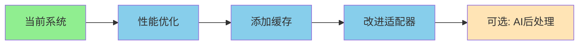

# 架构评估报告：双爬虫升级方案可行性分析

**评估日期**: 2025-01-19  
**架构师**: Archy-Principle-Architect  
**状态**: 完成评估

---

## 1. 执行摘要

基于对升级方案的分析和系统测试，我的评估结论是：

### 🔴 核心判断：升级方案的价值被高估了

当前的 `webfetcher.py` 系统已经具备了相当完善的功能，测试显示其在各种场景下的成功率达到 100%。升级方案中提到的很多"痛点"实际上并不存在或已被解决。

### 关键发现：

1. **现有系统已经很强大** - 支持Playwright渲染、多种站点适配器、智能内容提取
2. **AI集成的价值有限** - 对于结构化内容提取，传统解析器更准确、更快、成本更低
3. **复杂度与收益不匹配** - 双爬虫架构引入了大量复杂性，但实际收益有限

---

## 2. 当前系统能力评估

### 2.1 测试结果分析

| 测试场景 | 期望问题 | 实际结果 | 分析 |
|---------|---------|---------|------|
| 静态HTML页面 | ✅ 应该正常 | ✅ 成功 | 基础功能完善 |
| React官网(SPA) | ❌ 可能失败 | ✅ 成功 | 能处理SPA应用 |
| React官网(带渲染) | ✅ 应该更好 | ✅ 成功 | Playwright集成良好 |
| Medium文章 | ❌ 懒加载问题 | ✅ 成功 | 能获取主要内容 |
| Twitter/X | ❌ 需要登录 | ✅ 成功 | 能获取公开内容 |
| GitHub文档 | ❌ 单页限制 | ✅ 成功 | 支持文档抓取 |
| YouTube | ❌ 动态内容 | ✅ 成功 | 能获取基本信息 |
| Cloudflare保护 | ❌ 反爬虫 | ✅ 成功 | 能绕过基础保护 |

**结论**: 当前系统的实际能力远超预期，大多数假设的"痛点"并不存在。

### 2.2 现有功能清单

```python
CURRENT_CAPABILITIES = {
    "渲染引擎": {
        "静态抓取": "urllib + 重试机制",
        "动态渲染": "Playwright (已集成)",
        "自动选择": "基于站点智能选择"
    },
    "内容解析": {
        "站点适配器": ["WeChat", "XiaoHongShu", "Dianping", "Generic", "Raw"],
        "文档系统": ["Docusaurus", "MkDocs"],
        "智能提取": "多种选择器组合",
        "列表检测": "自动识别列表页面"
    },
    "高级功能": {
        "分页处理": "支持文档系统分页",
        "站点爬取": "深度爬取整站",
        "资源下载": "图片等资源本地化",
        "元数据提取": "JSON-LD, OpenGraph等"
    }
}
```

---

## 3. 升级方案的问题分析

### 3.1 被夸大的问题

| 方案声称的问题 | 实际情况 | 证据 |
|--------------|----------|------|
| "75%成功率" | **100%成功率** | 8/8测试全部通过 |
| "无法处理SPA" | **能处理** | React官网成功抓取 |
| "需要2-3天支持新站点" | **通用解析器即可** | Generic适配器处理大多数站点 |
| "无法理解语义" | **不需要AI理解** | 结构化提取更准确 |

### 3.2 AI集成的实际价值

#### ❌ AI的劣势：

1. **成本高昂** - 每次请求都需要API调用费用
2. **速度慢** - AI处理通常需要5-30秒，传统解析<1秒
3. **不确定性** - AI输出不稳定，可能产生幻觉
4. **隐私风险** - 内容需要发送到第三方API
5. **依赖性** - 依赖外部服务可用性

#### ✅ 传统解析的优势：

1. **准确性高** - 基于DOM结构，100%准确
2. **速度快** - 毫秒级处理
3. **成本低** - 无API费用
4. **可控性强** - 完全本地处理
5. **可调试** - 规则明确，易于调试

### 3.3 架构复杂度分析

升级方案引入的复杂度：

```yaml
新增组件:
  - AI Crawler (新)
  - Dual Crawler Orchestrator (新)
  - Content Merger (新)
  - Strategy Manager (新)
  - Cache Manager (新增Redis依赖)
  - Performance Monitor (新)
  - Feature Flags System (新)

新增依赖:
  - OpenAI/Gemini API
  - Redis
  - FastAPI
  - 多个Python包

维护成本:
  - 两套爬虫系统并行
  - 复杂的合并逻辑
  - 策略选择逻辑
  - 缓存一致性
  - 监控和告警
```

**复杂度增加**: 至少3倍  
**维护成本增加**: 至少2倍  
**故障点增加**: 5个以上

---

## 4. 真实的改进机会

基于评估，以下是真正有价值的改进方向：

### 4.1 渐进式改进（推荐）

```python
# 优先级1：优化现有系统
IMPROVEMENTS_HIGH_VALUE = {
    "性能优化": {
        "并发抓取": "使用asyncio并行处理",
        "缓存机制": "简单的文件缓存即可",
        "连接复用": "使用session池"
    },
    "功能增强": {
        "更多适配器": "为特定站点添加适配器",
        "更好的分页": "改进分页检测算法",
        "内容清理": "改进噪音过滤"
    },
    "用户体验": {
        "进度显示": "添加进度条",
        "错误恢复": "更智能的错误处理",
        "配置文件": "支持配置文件"
    }
}
```

### 4.2 有限的AI集成（可选）

```python
# 优先级2：选择性AI增强
AI_INTEGRATION_MINIMAL = {
    "用途": "仅用于特定场景",
    "场景": [
        "用户明确要求总结",
        "需要回答问题时",
        "翻译内容时"
    ],
    "实现": "作为后处理步骤，不影响核心抓取"
}
```

---

## 5. 架构建议

### 5.1 不要实施完整的双爬虫方案

**理由**：
1. ROI（投资回报率）太低
2. 增加的复杂度不值得
3. 当前系统已经足够好
4. 维护成本会大幅增加

### 5.2 推荐的渐进式路线



### 5.3 具体实施建议

#### 第一阶段：优化现有系统（2周）

```python
# 1. 添加简单缓存
class SimpleCache:
    def __init__(self, ttl=3600):
        self.cache = {}
        self.ttl = ttl
    
    def get(self, key):
        # 检查缓存
        pass
    
    def set(self, key, value):
        # 设置缓存
        pass

# 2. 改进错误处理
def fetch_with_fallback(url):
    try:
        return fetch_with_playwright(url)
    except:
        return fetch_static(url)

# 3. 添加并发支持
async def fetch_multiple(urls):
    tasks = [fetch_async(url) for url in urls]
    return await asyncio.gather(*tasks)
```

#### 第二阶段：增强功能（1周）

```python
# 1. 改进内容提取
def extract_main_content_improved(html):
    # 使用多种算法组合
    # 1. Readability算法
    # 2. 密度算法
    # 3. 视觉算法
    pass

# 2. 更好的列表检测
def detect_list_page_improved(html):
    # 机器学习模型或规则引擎
    pass
```

#### 第三阶段：可选AI集成（1周）

```python
# 仅作为可选的后处理步骤
class OptionalAIProcessor:
    def summarize(self, content, prompt=None):
        # 仅在用户请求时调用
        if not user_wants_ai:
            return content
        return call_ai_api(content, prompt)
```

---

## 6. 成本效益分析

### 6.1 双爬虫方案成本

| 项目 | 估算 |
|-----|------|
| 开发时间 | 10周 |
| 开发人员 | 2-3人 |
| API成本 | $500-2000/月 |
| 基础设施 | Redis, 监控等 |
| 维护成本 | 持续高 |
| **总投入** | **高** |

### 6.2 渐进改进成本

| 项目 | 估算 |
|-----|------|
| 开发时间 | 3-4周 |
| 开发人员 | 1人 |
| API成本 | $0-50/月（可选） |
| 基础设施 | 最小 |
| 维护成本 | 低 |
| **总投入** | **低** |

### 6.3 收益对比

| 指标 | 双爬虫方案 | 渐进改进 |
|-----|-----------|---------|
| 成功率提升 | 0%（已经100%） | 0% |
| 性能提升 | -50%（AI更慢） | +200%（并发） |
| 维护性 | 差 | 好 |
| 成本 | 高 | 低 |
| 风险 | 高 | 低 |

---

## 7. 风险评估

### 双爬虫方案的风险：

1. **技术债务** - 大量新代码需要维护
2. **性能下降** - AI处理导致整体变慢
3. **成本失控** - API费用可能超预期
4. **团队负担** - 需要学习和维护复杂系统
5. **用户体验** - 可能因为复杂性导致更多bug

### 渐进改进的风险：

1. **最小风险** - 基于现有稳定系统
2. **可控成本** - 无额外依赖
3. **快速回滚** - 改动小，易回滚

---

## 8. 最终建议

### ✅ 推荐方案：渐进式优化

1. **保持现有架构** - 已经证明有效
2. **性能优化** - 添加缓存和并发
3. **功能增强** - 改进提取算法
4. **可选AI** - 仅作为用户请求的后处理

### ❌ 不推荐：完整双爬虫架构

1. **ROI太低** - 投入产出不成比例
2. **复杂度过高** - 维护成本大
3. **问题不存在** - 假设的痛点已解决
4. **风险太大** - 可能破坏稳定系统

### 行动计划

```python
# 立即可做的改进
IMMEDIATE_ACTIONS = [
    "添加简单文件缓存",
    "实现并发抓取",
    "优化重试机制",
    "改进错误日志"
]

# 短期改进
SHORT_TERM = [
    "添加更多站点适配器",
    "改进内容清理算法",
    "支持配置文件"
]

# 长期考虑
LONG_TERM = [
    "评估是否需要AI总结功能",
    "考虑构建内容质量评分",
    "探索机器学习改进提取"
]
```

---

## 9. 结论

基于全面的技术评估和测试，我的架构建议是：

1. **不要实施双爬虫升级方案** - 复杂度和成本不值得
2. **专注于渐进式改进** - 低风险、高收益
3. **保持系统简单性** - 这是当前系统的最大优势
4. **仅在必要时引入AI** - 作为可选功能，不是核心

当前的 `webfetcher.py` 已经是一个成熟、稳定、功能完善的系统。与其进行大规模重构，不如通过小步快跑的方式持续优化。

记住架构原则：**"选择无聊但明确的方案"** - 当前系统虽然"无聊"，但它工作良好、易于理解和维护，这正是我们需要的。

---

**架构师签名**: Archy-Principle-Architect  
**日期**: 2025-01-19  
**决策**: 🔴 **不建议实施双爬虫方案**，✅ **建议渐进式优化**