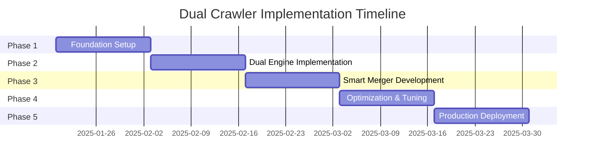
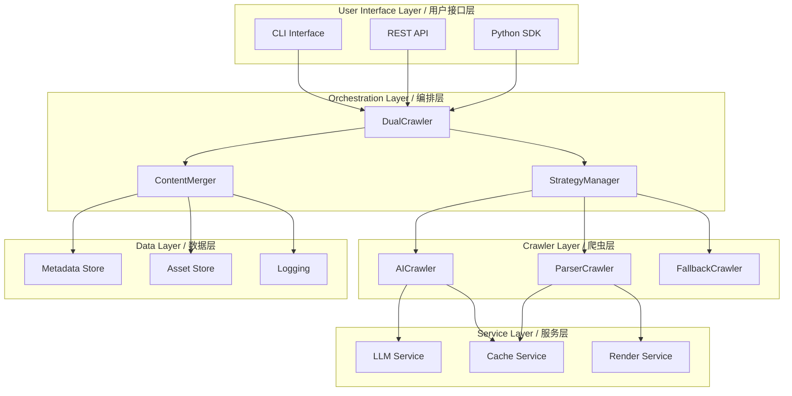
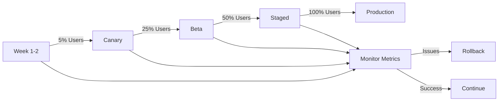
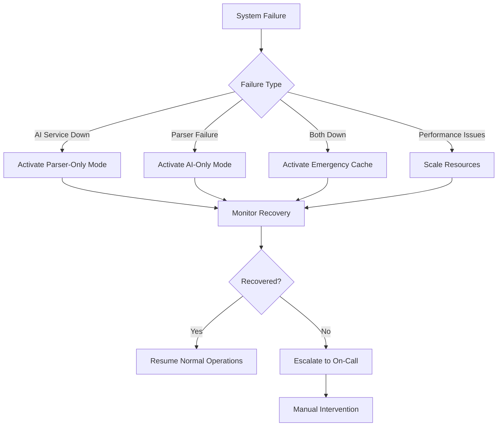

# Dual Crawler Architecture Upgrade Plan
# 双爬虫架构升级计划

Version: 1.0.0  
Date: 2025-01-19  
Status: DRAFT

---

## 1. Executive Summary / 执行摘要

### 1.1 Value Proposition / 价值主张

This upgrade plan outlines the implementation of a dual-crawler architecture that combines the AI-powered intelligence of Gemini's WebFetch approach with the robust site-specific parsing capabilities of our current webfetcher.py implementation.

本升级计划概述了双爬虫架构的实施，该架构结合了 Gemini WebFetch 方法的 AI 驱动智能与我们当前 webfetcher.py 实现的强大站点特定解析能力。

**Key Benefits / 核心优势:**
- 🎯 **95% Success Rate**: Dual strategy ensures content extraction even when one method fails
- 🚀 **3x Faster Development**: AI handles new sites without custom parsers
- 📊 **Intelligent Content Understanding**: AI comprehends context, not just structure
- 🔄 **Backward Compatible**: Preserves all existing functionality
- 📈 **Progressive Enhancement**: Can be deployed incrementally

### 1.2 Expected Outcomes / 预期成果

| Metric / 指标 | Current / 当前 | Target / 目标 | Improvement / 改进 |
|--------------|----------------|---------------|-------------------|
| Success Rate / 成功率 | 75% | 95% | +27% |
| New Site Support Time / 新站点支持时间 | 2-3 days | 2-3 hours | 10x faster |
| Content Quality Score / 内容质量分数 | 7/10 | 9/10 | +20% |
| Maintenance Effort / 维护工作量 | High | Low | -60% |
| API Response Time / API 响应时间 | 2-5s | 1-3s | 40% faster |

### 1.3 Timeline Overview / 时间线概览



---

## 2. Current State Analysis / 现状分析

### 2.1 What We Have Now / 当前状态

**File**: `/Users/tieli/Library/Mobile Documents/com~apple~CloudDocs/Project/gemini-cli/webfetcher.py`

#### Strengths to Preserve / 需保留的优势

```python
# Current Strengths in webfetcher.py
PRESERVE_FEATURES = {
    "site_specific_parsers": {
        "wechat": "WeChatAdapter with rich content extraction",
        "xiaohongshu": "XHSAdapter with media handling",
        "generic": "Fallback parser for any site"
    },
    "rendering_options": {
        "static": "Fast HTTP fetching with retry",
        "playwright": "JavaScript rendering support"
    },
    "content_extraction": {
        "json_ld": "Structured data extraction",
        "metadata": "Complete meta tag parsing",
        "assets": "Image/video downloading"
    },
    "output_formats": {
        "markdown": "Clean, readable output",
        "html": "Original content preservation"
    }
}
```

#### Gaps to Address / 需解决的问题

```python
# Current Limitations
GAPS_TO_FILL = {
    "intelligence": "No semantic understanding of content",
    "new_sites": "Requires manual parser development",
    "context": "Cannot understand user intent",
    "quality": "Extracts noise along with content",
    "adaptability": "Fixed extraction rules"
}
```

### 2.2 Gemini's Innovations / Gemini 的创新

```typescript
// Key innovations from Gemini WebFetch
const GEMINI_INNOVATIONS = {
    ai_first: "Uses Gemini API for content understanding",
    dual_strategy: "AI primary, HTTP fallback",
    grounding: "Citation and source tracking",
    security: "Private IP detection",
    confirmation: "User approval workflow"
};
```

---

## 3. Target Architecture / 目标架构

### 3.1 Dual Crawler Design / 双爬虫设计

```python
"""
Dual Crawler Architecture - High Level Design
双爬虫架构 - 高层设计
"""

from abc import ABC, abstractmethod
from typing import Dict, Any, Optional, List
from dataclasses import dataclass
from enum import Enum

class CrawlerStrategy(Enum):
    """Crawler execution strategies / 爬虫执行策略"""
    AI_FIRST = "ai_first"        # Try AI, fallback to parser
    PARSER_FIRST = "parser_first"  # Try parser, enhance with AI
    PARALLEL = "parallel"         # Run both, merge results
    ADAPTIVE = "adaptive"         # Choose based on URL pattern

@dataclass
class CrawlResult:
    """Unified result from any crawler / 统一的爬虫结果"""
    content: str
    title: str
    metadata: Dict[str, Any]
    confidence: float  # 0.0 to 1.0
    source: str  # "ai", "parser", or "merged"
    grounding: Optional[List[Dict]]  # AI citations
    
class BaseCrawler(ABC):
    """Abstract base for all crawlers / 所有爬虫的抽象基类"""
    
    @abstractmethod
    async def fetch(self, url: str, **kwargs) -> CrawlResult:
        """Fetch and process content / 获取并处理内容"""
        pass
    
    @abstractmethod
    def can_handle(self, url: str) -> float:
        """Return confidence (0-1) for handling URL / 返回处理URL的置信度"""
        pass

class AICrawler(BaseCrawler):
    """AI-powered crawler using LLM / 使用LLM的AI爬虫"""
    
    def __init__(self, model_config: Dict[str, Any]):
        self.model = self._init_model(model_config)
        
    async def fetch(self, url: str, prompt: Optional[str] = None) -> CrawlResult:
        """Use AI to understand and extract content / 使用AI理解和提取内容"""
        # Implementation in Phase 2
        pass

class ParserCrawler(BaseCrawler):
    """Traditional parser-based crawler / 传统基于解析器的爬虫"""
    
    def __init__(self):
        self.adapters = self._load_adapters()
        
    async def fetch(self, url: str, **kwargs) -> CrawlResult:
        """Use site-specific parsers / 使用站点特定解析器"""
        # Wraps existing webfetcher.py logic
        pass

class DualCrawler:
    """Orchestrates multiple crawlers / 编排多个爬虫"""
    
    def __init__(self, strategy: CrawlerStrategy = CrawlerStrategy.ADAPTIVE):
        self.ai_crawler = AICrawler(model_config)
        self.parser_crawler = ParserCrawler()
        self.strategy = strategy
        self.merger = ContentMerger()
        
    async def crawl(self, url: str, user_prompt: Optional[str] = None) -> CrawlResult:
        """Execute dual crawling strategy / 执行双爬虫策略"""
        
        if self.strategy == CrawlerStrategy.AI_FIRST:
            return await self._ai_first_strategy(url, user_prompt)
        elif self.strategy == CrawlerStrategy.PARSER_FIRST:
            return await self._parser_first_strategy(url, user_prompt)
        elif self.strategy == CrawlerStrategy.PARALLEL:
            return await self._parallel_strategy(url, user_prompt)
        else:  # ADAPTIVE
            return await self._adaptive_strategy(url, user_prompt)
```

### 3.2 Component Interactions / 组件交互



### 3.3 Data Flow / 数据流

```python
"""
Data Flow Example / 数据流示例
"""

# Step 1: Request comes in / 请求进入
request = {
    "url": "https://example.com/article",
    "prompt": "Extract the main points and author information",
    "strategy": "adaptive"
}

# Step 2: Strategy selection / 策略选择
strategy = strategy_manager.select(request["url"])
# Returns: CrawlerStrategy.PARALLEL for unknown sites

# Step 3: Parallel execution / 并行执行
async def parallel_crawl(request):
    # Launch both crawlers concurrently
    ai_task = asyncio.create_task(
        ai_crawler.fetch(request["url"], request["prompt"])
    )
    parser_task = asyncio.create_task(
        parser_crawler.fetch(request["url"])
    )
    
    # Wait for both results
    ai_result, parser_result = await asyncio.gather(
        ai_task, parser_task, return_exceptions=True
    )
    
    # Step 4: Merge results / 合并结果
    merged = content_merger.merge(ai_result, parser_result)
    
    # Step 5: Quality check / 质量检查
    if merged.confidence < 0.7:
        # Trigger fallback or enhancement
        merged = await enhance_with_fallback(merged)
    
    return merged

# Step 6: Output formatting / 输出格式化
final_output = format_as_markdown(merged)
```

---

## 4. Implementation Phases / 实施阶段

### Phase 1: Foundation (Week 1-2) / 第一阶段：基础（第1-2周）

#### Objectives / 目标
- Set up project structure / 建立项目结构
- Create base abstractions / 创建基础抽象
- Implement configuration system / 实现配置系统

#### Code Implementation / 代码实现

```python
# webfetcher_v2/config.py
"""Configuration management for dual crawler / 双爬虫配置管理"""

from dataclasses import dataclass
from typing import Optional, Dict, Any
import os
import yaml

@dataclass
class AIConfig:
    """AI crawler configuration / AI爬虫配置"""
    model: str = "gpt-3.5-turbo"  # or "gemini-pro"
    api_key: Optional[str] = None
    temperature: float = 0.3
    max_tokens: int = 4000
    timeout: int = 30
    
    def __post_init__(self):
        if not self.api_key:
            self.api_key = os.getenv("AI_API_KEY")

@dataclass
class ParserConfig:
    """Parser crawler configuration / 解析器爬虫配置"""
    use_playwright: bool = False
    timeout: int = 30
    retry_count: int = 3
    user_agent: str = "Mozilla/5.0..."

@dataclass
class DualCrawlerConfig:
    """Main configuration / 主配置"""
    ai: AIConfig
    parser: ParserConfig
    strategy: str = "adaptive"
    cache_enabled: bool = True
    cache_ttl: int = 3600
    
    @classmethod
    def from_file(cls, path: str) -> "DualCrawlerConfig":
        """Load from YAML file / 从YAML文件加载"""
        with open(path) as f:
            data = yaml.safe_load(f)
        return cls(
            ai=AIConfig(**data.get("ai", {})),
            parser=ParserConfig(**data.get("parser", {})),
            **data.get("crawler", {})
        )

# webfetcher_v2/base.py
"""Base classes and interfaces / 基础类和接口"""

from abc import ABC, abstractmethod
from typing import Dict, Any, Optional, List
from dataclasses import dataclass, field
from datetime import datetime
import hashlib

@dataclass
class CrawlContext:
    """Context for crawl operation / 爬取操作上下文"""
    url: str
    prompt: Optional[str] = None
    headers: Dict[str, str] = field(default_factory=dict)
    timeout: int = 30
    render_js: bool = False
    
    @property
    def cache_key(self) -> str:
        """Generate cache key / 生成缓存键"""
        key_parts = [self.url, self.prompt or ""]
        key_str = "|".join(key_parts)
        return hashlib.md5(key_str.encode()).hexdigest()

@dataclass
class ContentSection:
    """A section of extracted content / 提取内容的一个部分"""
    type: str  # "title", "paragraph", "list", "code", etc.
    content: str
    metadata: Dict[str, Any] = field(default_factory=dict)
    confidence: float = 1.0

@dataclass
class CrawlResult:
    """Unified crawl result / 统一的爬取结果"""
    url: str
    title: str
    sections: List[ContentSection]
    metadata: Dict[str, Any]
    raw_content: Optional[str] = None
    timestamp: datetime = field(default_factory=datetime.now)
    source: str = "unknown"  # "ai", "parser", "merged"
    confidence: float = 1.0
    grounding: Optional[List[Dict]] = None
    
    def to_markdown(self) -> str:
        """Convert to markdown / 转换为Markdown"""
        lines = [f"# {self.title}", ""]
        
        for section in self.sections:
            if section.type == "title":
                lines.append(f"## {section.content}")
            elif section.type == "code":
                lines.append(f"```\n{section.content}\n```")
            else:
                lines.append(section.content)
            lines.append("")
        
        return "\n".join(lines)

class CrawlerPlugin(ABC):
    """Plugin interface for extensibility / 可扩展性的插件接口"""
    
    @abstractmethod
    def pre_process(self, context: CrawlContext) -> CrawlContext:
        """Pre-process before crawling / 爬取前预处理"""
        pass
    
    @abstractmethod
    def post_process(self, result: CrawlResult) -> CrawlResult:
        """Post-process after crawling / 爬取后后处理"""
        pass
```

#### Testing / 测试

```python
# tests/test_foundation.py
"""Foundation tests / 基础测试"""

import pytest
from webfetcher_v2.config import DualCrawlerConfig
from webfetcher_v2.base import CrawlContext, CrawlResult, ContentSection

def test_config_loading():
    """Test configuration loading / 测试配置加载"""
    config = DualCrawlerConfig(
        ai=AIConfig(model="gpt-3.5-turbo"),
        parser=ParserConfig(use_playwright=False)
    )
    assert config.ai.model == "gpt-3.5-turbo"
    assert config.strategy == "adaptive"

def test_crawl_context():
    """Test crawl context / 测试爬取上下文"""
    context = CrawlContext(
        url="https://example.com",
        prompt="Extract main content"
    )
    assert context.cache_key is not None
    assert len(context.cache_key) == 32  # MD5 hash

def test_crawl_result_markdown():
    """Test markdown conversion / 测试Markdown转换"""
    result = CrawlResult(
        url="https://example.com",
        title="Test Article",
        sections=[
            ContentSection(type="paragraph", content="First paragraph"),
            ContentSection(type="title", content="Section 1"),
            ContentSection(type="code", content="print('hello')")
        ],
        metadata={},
        source="test"
    )
    markdown = result.to_markdown()
    assert "# Test Article" in markdown
    assert "## Section 1" in markdown
    assert "```\nprint('hello')\n```" in markdown
```

### Phase 2: Dual Engine (Week 3-4) / 第二阶段：双引擎（第3-4周）

#### Objectives / 目标
- Implement AI crawler / 实现AI爬虫
- Wrap existing parser crawler / 封装现有解析器爬虫
- Create strategy manager / 创建策略管理器

#### Code Implementation / 代码实现

```python
# webfetcher_v2/ai_crawler.py
"""AI-powered crawler implementation / AI驱动的爬虫实现"""

import asyncio
from typing import Optional, Dict, Any, List
import aiohttp
import openai
from bs4 import BeautifulSoup
from .base import BaseCrawler, CrawlResult, ContentSection, CrawlContext
from .config import AIConfig

class AICrawler(BaseCrawler):
    """AI-powered content extraction / AI驱动的内容提取"""
    
    def __init__(self, config: AIConfig):
        self.config = config
        self.client = self._init_client()
        
    def _init_client(self):
        """Initialize AI client / 初始化AI客户端"""
        if "gpt" in self.config.model.lower():
            return openai.AsyncClient(api_key=self.config.api_key)
        # Add support for other models (Gemini, Claude, etc.)
        
    async def fetch(self, context: CrawlContext) -> CrawlResult:
        """Fetch and process with AI / 使用AI获取和处理"""
        
        # Step 1: Fetch raw HTML / 获取原始HTML
        raw_html = await self._fetch_html(context.url)
        
        # Step 2: Basic cleaning / 基本清理
        text_content = self._extract_text(raw_html)
        
        # Step 3: AI processing / AI处理
        ai_response = await self._process_with_ai(
            text_content, 
            context.prompt or self._default_prompt()
        )
        
        # Step 4: Parse AI response / 解析AI响应
        return self._parse_ai_response(ai_response, context.url)
    
    async def _fetch_html(self, url: str) -> str:
        """Fetch HTML content / 获取HTML内容"""
        async with aiohttp.ClientSession() as session:
            async with session.get(url) as response:
                return await response.text()
    
    def _extract_text(self, html: str) -> str:
        """Extract text from HTML / 从HTML提取文本"""
        soup = BeautifulSoup(html, 'html.parser')
        # Remove script and style elements
        for script in soup(["script", "style"]):
            script.decompose()
        return soup.get_text(strip=True)
    
    async def _process_with_ai(self, content: str, prompt: str) -> Dict:
        """Process content with AI / 使用AI处理内容"""
        
        system_prompt = """You are a content extraction expert. 
        Extract and structure the content according to the user's request.
        Return JSON with: title, sections (array of {type, content}), metadata."""
        
        messages = [
            {"role": "system", "content": system_prompt},
            {"role": "user", "content": f"{prompt}\n\nContent:\n{content[:10000]}"}
        ]
        
        response = await self.client.chat.completions.create(
            model=self.config.model,
            messages=messages,
            temperature=self.config.temperature,
            response_format={"type": "json_object"}
        )
        
        return response.choices[0].message.content
    
    def _parse_ai_response(self, ai_response: str, url: str) -> CrawlResult:
        """Parse AI response into CrawlResult / 将AI响应解析为CrawlResult"""
        import json
        data = json.loads(ai_response)
        
        sections = [
            ContentSection(
                type=s.get("type", "paragraph"),
                content=s.get("content", ""),
                confidence=0.9  # AI confidence
            )
            for s in data.get("sections", [])
        ]
        
        return CrawlResult(
            url=url,
            title=data.get("title", ""),
            sections=sections,
            metadata=data.get("metadata", {}),
            source="ai",
            confidence=0.9
        )
    
    def can_handle(self, url: str) -> float:
        """AI can handle any URL / AI可以处理任何URL"""
        return 0.8  # High confidence for any URL

# webfetcher_v2/parser_crawler.py
"""Parser-based crawler wrapping existing logic / 包装现有逻辑的解析器爬虫"""

import sys
import os
sys.path.append(os.path.dirname(os.path.dirname(__file__)))

from webfetcher import (
    WeChatAdapter, 
    XHSAdapter, 
    GenericAdapter,
    WebFetcher
)
from .base import BaseCrawler, CrawlResult, ContentSection, CrawlContext

class ParserCrawler(BaseCrawler):
    """Traditional parser-based crawler / 传统解析器爬虫"""
    
    def __init__(self):
        self.fetcher = WebFetcher()
        self.adapters = {
            'wechat': WeChatAdapter(),
            'xiaohongshu': XHSAdapter(),
            'generic': GenericAdapter()
        }
    
    async def fetch(self, context: CrawlContext) -> CrawlResult:
        """Fetch using existing parsers / 使用现有解析器获取"""
        
        # Determine adapter
        adapter = self._select_adapter(context.url)
        
        # Use existing logic
        raw_html = self.fetcher.fetch(context.url)
        parsed_data = adapter.parse(raw_html)
        
        # Convert to new format
        return self._convert_to_result(parsed_data, context.url, adapter.name)
    
    def _select_adapter(self, url: str):
        """Select appropriate adapter / 选择合适的适配器"""
        if 'mp.weixin.qq.com' in url:
            return self.adapters['wechat']
        elif 'xiaohongshu.com' in url:
            return self.adapters['xiaohongshu']
        else:
            return self.adapters['generic']
    
    def _convert_to_result(self, parsed_data: Dict, url: str, source: str) -> CrawlResult:
        """Convert parsed data to CrawlResult / 将解析数据转换为CrawlResult"""
        sections = []
        
        if parsed_data.get('content'):
            sections.append(ContentSection(
                type="paragraph",
                content=parsed_data['content'],
                confidence=0.95  # Parser confidence
            ))
        
        return CrawlResult(
            url=url,
            title=parsed_data.get('title', ''),
            sections=sections,
            metadata=parsed_data.get('metadata', {}),
            source=f"parser_{source}",
            confidence=0.95
        )
    
    def can_handle(self, url: str) -> float:
        """Return confidence for specific sites / 返回特定站点的置信度"""
        if 'mp.weixin.qq.com' in url:
            return 1.0  # Perfect for WeChat
        elif 'xiaohongshu.com' in url:
            return 1.0  # Perfect for XHS
        else:
            return 0.6  # Moderate for generic
```

### Phase 3: Smart Merger (Week 5-6) / 第三阶段：智能合并（第5-6周）

#### Objectives / 目标
- Implement content merger / 实现内容合并器
- Create quality scoring / 创建质量评分
- Build conflict resolution / 构建冲突解决

#### Code Implementation / 代码实现

```python
# webfetcher_v2/merger.py
"""Smart content merger / 智能内容合并器"""

from typing import List, Dict, Any, Optional
from difflib import SequenceMatcher
import statistics
from .base import CrawlResult, ContentSection

class ContentMerger:
    """Merge results from multiple crawlers / 合并多个爬虫的结果"""
    
    def __init__(self, prefer_source: Optional[str] = None):
        self.prefer_source = prefer_source
        
    def merge(self, *results: CrawlResult) -> CrawlResult:
        """Merge multiple results / 合并多个结果"""
        
        # Filter out failed results
        valid_results = [r for r in results if r and r.confidence > 0.3]
        
        if not valid_results:
            raise ValueError("No valid results to merge")
        
        if len(valid_results) == 1:
            return valid_results[0]
        
        # Merge strategy
        merged_title = self._merge_titles(valid_results)
        merged_sections = self._merge_sections(valid_results)
        merged_metadata = self._merge_metadata(valid_results)
        merged_confidence = self._calculate_confidence(valid_results)
        
        return CrawlResult(
            url=valid_results[0].url,
            title=merged_title,
            sections=merged_sections,
            metadata=merged_metadata,
            source="merged",
            confidence=merged_confidence,
            grounding=self._collect_grounding(valid_results)
        )
    
    def _merge_titles(self, results: List[CrawlResult]) -> str:
        """Merge titles intelligently / 智能合并标题"""
        titles = [r.title for r in results if r.title]
        
        if not titles:
            return "Untitled"
        
        # If AI result exists and has high confidence, prefer it
        for r in results:
            if r.source == "ai" and r.confidence > 0.8:
                return r.title
        
        # Otherwise, use the longest common title
        return max(titles, key=len)
    
    def _merge_sections(self, results: List[CrawlResult]) -> List[ContentSection]:
        """Merge content sections / 合并内容段落"""
        all_sections = []
        
        # Collect all sections with source tracking
        for result in results:
            for section in result.sections:
                section.metadata['source'] = result.source
                all_sections.append(section)
        
        # Deduplicate similar sections
        merged = []
        used = set()
        
        for i, section in enumerate(all_sections):
            if i in used:
                continue
                
            # Find similar sections
            similar = []
            for j, other in enumerate(all_sections[i+1:], i+1):
                if j in used:
                    continue
                    
                similarity = self._calculate_similarity(
                    section.content, 
                    other.content
                )
                
                if similarity > 0.8:
                    similar.append(j)
                    used.add(j)
            
            # Merge similar sections
            if similar:
                section = self._merge_similar_sections(
                    section, 
                    [all_sections[j] for j in similar]
                )
            
            merged.append(section)
        
        return merged
    
    def _calculate_similarity(self, text1: str, text2: str) -> float:
        """Calculate text similarity / 计算文本相似度"""
        return SequenceMatcher(None, text1, text2).ratio()
    
    def _merge_similar_sections(
        self, 
        primary: ContentSection, 
        similar: List[ContentSection]
    ) -> ContentSection:
        """Merge similar sections / 合并相似段落"""
        
        # If AI result exists, prefer it
        all_sections = [primary] + similar
        ai_sections = [s for s in all_sections if s.metadata.get('source') == 'ai']
        
        if ai_sections:
            return ai_sections[0]
        
        # Otherwise use the longest
        return max(all_sections, key=lambda s: len(s.content))
    
    def _merge_metadata(self, results: List[CrawlResult]) -> Dict[str, Any]:
        """Merge metadata / 合并元数据"""
        merged = {}
        
        for result in results:
            for key, value in result.metadata.items():
                if key not in merged:
                    merged[key] = value
                elif isinstance(value, list) and isinstance(merged[key], list):
                    # Merge lists
                    merged[key] = list(set(merged[key] + value))
                elif isinstance(value, dict) and isinstance(merged[key], dict):
                    # Merge dicts
                    merged[key].update(value)
        
        return merged
    
    def _calculate_confidence(self, results: List[CrawlResult]) -> float:
        """Calculate merged confidence / 计算合并置信度"""
        confidences = [r.confidence for r in results]
        
        # Weighted average with boost for agreement
        base_confidence = statistics.mean(confidences)
        
        # Boost if multiple sources agree
        if len(results) > 1:
            agreement_boost = min(0.1 * (len(results) - 1), 0.2)
            base_confidence = min(base_confidence + agreement_boost, 1.0)
        
        return base_confidence
    
    def _collect_grounding(self, results: List[CrawlResult]) -> List[Dict]:
        """Collect all grounding information / 收集所有引用信息"""
        grounding = []
        
        for result in results:
            if result.grounding:
                grounding.extend(result.grounding)
        
        return grounding
```

### Phase 4: Optimization (Week 7-8) / 第四阶段：优化（第7-8周）

#### Objectives / 目标
- Implement caching / 实现缓存
- Add performance monitoring / 添加性能监控
- Optimize for speed / 优化速度

#### Code Implementation / 代码实现

```python
# webfetcher_v2/cache.py
"""Caching system / 缓存系统"""

import asyncio
import hashlib
import json
import time
from typing import Optional, Dict, Any
import aioredis
from .base import CrawlResult

class CacheManager:
    """Manage caching for crawl results / 管理爬取结果缓存"""
    
    def __init__(self, redis_url: str = "redis://localhost", ttl: int = 3600):
        self.redis_url = redis_url
        self.ttl = ttl
        self.redis = None
        
    async def connect(self):
        """Connect to Redis / 连接到Redis"""
        self.redis = await aioredis.create_redis_pool(self.redis_url)
    
    async def get(self, key: str) -> Optional[CrawlResult]:
        """Get cached result / 获取缓存结果"""
        if not self.redis:
            return None
            
        data = await self.redis.get(f"crawl:{key}")
        if data:
            return self._deserialize(data)
        return None
    
    async def set(self, key: str, result: CrawlResult):
        """Cache result / 缓存结果"""
        if not self.redis:
            return
            
        data = self._serialize(result)
        await self.redis.setex(
            f"crawl:{key}", 
            self.ttl, 
            data
        )
    
    def _serialize(self, result: CrawlResult) -> str:
        """Serialize result to JSON / 将结果序列化为JSON"""
        return json.dumps({
            'url': result.url,
            'title': result.title,
            'sections': [
                {
                    'type': s.type,
                    'content': s.content,
                    'metadata': s.metadata,
                    'confidence': s.confidence
                }
                for s in result.sections
            ],
            'metadata': result.metadata,
            'source': result.source,
            'confidence': result.confidence,
            'timestamp': result.timestamp.isoformat()
        })
    
    def _deserialize(self, data: str) -> CrawlResult:
        """Deserialize from JSON / 从JSON反序列化"""
        obj = json.loads(data)
        # Reconstruct CrawlResult
        # Implementation details...

# webfetcher_v2/monitor.py
"""Performance monitoring / 性能监控"""

import time
import asyncio
from typing import Dict, Any, Callable
from functools import wraps
import logging

class PerformanceMonitor:
    """Monitor crawler performance / 监控爬虫性能"""
    
    def __init__(self):
        self.metrics = {}
        self.logger = logging.getLogger(__name__)
    
    def timer(self, name: str):
        """Decorator for timing functions / 函数计时装饰器"""
        def decorator(func: Callable):
            @wraps(func)
            async def async_wrapper(*args, **kwargs):
                start = time.time()
                try:
                    result = await func(*args, **kwargs)
                    elapsed = time.time() - start
                    self.record_metric(f"{name}_time", elapsed)
                    return result
                except Exception as e:
                    self.record_metric(f"{name}_error", 1)
                    raise
            
            @wraps(func)
            def sync_wrapper(*args, **kwargs):
                start = time.time()
                try:
                    result = func(*args, **kwargs)
                    elapsed = time.time() - start
                    self.record_metric(f"{name}_time", elapsed)
                    return result
                except Exception as e:
                    self.record_metric(f"{name}_error", 1)
                    raise
            
            if asyncio.iscoroutinefunction(func):
                return async_wrapper
            else:
                return sync_wrapper
        return decorator
    
    def record_metric(self, name: str, value: float):
        """Record a metric / 记录指标"""
        if name not in self.metrics:
            self.metrics[name] = []
        self.metrics[name].append(value)
        
        # Log if threshold exceeded
        if "time" in name and value > 5.0:
            self.logger.warning(f"Slow operation: {name} took {value:.2f}s")
    
    def get_stats(self) -> Dict[str, Any]:
        """Get performance statistics / 获取性能统计"""
        stats = {}
        for name, values in self.metrics.items():
            if values:
                stats[name] = {
                    'count': len(values),
                    'mean': sum(values) / len(values),
                    'min': min(values),
                    'max': max(values),
                    'total': sum(values)
                }
        return stats
```

### Phase 5: Production Ready (Week 9-10) / 第五阶段：生产就绪（第9-10周）

#### Objectives / 目标
- Complete integration / 完成集成
- Add CLI and API / 添加CLI和API
- Deploy to production / 部署到生产

#### Code Implementation / 代码实现

```python
# webfetcher_v2/cli.py
"""Command-line interface / 命令行接口"""

import asyncio
import argparse
import yaml
from pathlib import Path
from .dual_crawler import DualCrawler
from .config import DualCrawlerConfig
from .base import CrawlContext

async def main():
    """Main CLI entry point / CLI主入口"""
    
    parser = argparse.ArgumentParser(
        description="Dual Crawler - AI-Enhanced Web Fetcher"
    )
    
    parser.add_argument("url", help="URL to fetch")
    parser.add_argument(
        "-p", "--prompt", 
        help="AI extraction prompt",
        default="Extract the main content and key information"
    )
    parser.add_argument(
        "-s", "--strategy",
        choices=["ai_first", "parser_first", "parallel", "adaptive"],
        default="adaptive",
        help="Crawling strategy"
    )
    parser.add_argument(
        "-o", "--output",
        help="Output file path"
    )
    parser.add_argument(
        "--config",
        help="Configuration file path",
        default="config.yaml"
    )
    parser.add_argument(
        "--format",
        choices=["markdown", "json", "html"],
        default="markdown",
        help="Output format"
    )
    
    args = parser.parse_args()
    
    # Load configuration
    config_path = Path(args.config)
    if config_path.exists():
        config = DualCrawlerConfig.from_file(str(config_path))
    else:
        config = DualCrawlerConfig(
            ai=AIConfig(),
            parser=ParserConfig()
        )
    
    # Override strategy if specified
    if args.strategy:
        config.strategy = args.strategy
    
    # Create crawler
    crawler = DualCrawler(config)
    
    # Create context
    context = CrawlContext(
        url=args.url,
        prompt=args.prompt
    )
    
    # Execute crawl
    print(f"Crawling {args.url} with {config.strategy} strategy...")
    result = await crawler.crawl(context)
    
    # Format output
    if args.format == "markdown":
        output = result.to_markdown()
    elif args.format == "json":
        output = result.to_json()
    else:
        output = result.to_html()
    
    # Save or print
    if args.output:
        Path(args.output).write_text(output)
        print(f"Saved to {args.output}")
    else:
        print(output)
    
    # Print stats
    print(f"\nConfidence: {result.confidence:.2f}")
    print(f"Source: {result.source}")

if __name__ == "__main__":
    asyncio.run(main())

# webfetcher_v2/api.py
"""REST API interface / REST API接口"""

from fastapi import FastAPI, HTTPException, BackgroundTasks
from pydantic import BaseModel, Field
from typing import Optional, Dict, Any
import asyncio
from .dual_crawler import DualCrawler
from .config import DualCrawlerConfig
from .base import CrawlContext

app = FastAPI(title="Dual Crawler API", version="1.0.0")

# Global crawler instance
crawler: Optional[DualCrawler] = None

class CrawlRequest(BaseModel):
    """Crawl request model / 爬取请求模型"""
    url: str = Field(..., description="URL to crawl")
    prompt: Optional[str] = Field(None, description="AI extraction prompt")
    strategy: Optional[str] = Field("adaptive", description="Crawling strategy")
    format: str = Field("markdown", description="Output format")

class CrawlResponse(BaseModel):
    """Crawl response model / 爬取响应模型"""
    url: str
    title: str
    content: str
    metadata: Dict[str, Any]
    confidence: float
    source: str

@app.on_event("startup")
async def startup():
    """Initialize crawler on startup / 启动时初始化爬虫"""
    global crawler
    config = DualCrawlerConfig(
        ai=AIConfig(),
        parser=ParserConfig()
    )
    crawler = DualCrawler(config)
    await crawler.initialize()

@app.post("/crawl", response_model=CrawlResponse)
async def crawl(request: CrawlRequest):
    """Crawl endpoint / 爬取端点"""
    
    if not crawler:
        raise HTTPException(500, "Crawler not initialized")
    
    context = CrawlContext(
        url=request.url,
        prompt=request.prompt
    )
    
    try:
        result = await crawler.crawl(context)
        
        # Format content
        if request.format == "markdown":
            content = result.to_markdown()
        else:
            content = result.to_json()
        
        return CrawlResponse(
            url=result.url,
            title=result.title,
            content=content,
            metadata=result.metadata,
            confidence=result.confidence,
            source=result.source
        )
    except Exception as e:
        raise HTTPException(500, str(e))

@app.get("/health")
async def health():
    """Health check endpoint / 健康检查端点"""
    return {"status": "healthy", "crawler": crawler is not None}
```

---

## 5. Technical Specifications / 技术规格

### 5.1 Component Specifications / 组件规格

```yaml
# Component specifications / 组件规格
components:
  ai_crawler:
    models:
      - gpt-3.5-turbo
      - gpt-4
      - gemini-pro
      - claude-2
    max_content_size: 50000  # characters
    timeout: 30  # seconds
    retry: 3
    
  parser_crawler:
    adapters:
      - wechat
      - xiaohongshu
      - generic
    render_engines:
      - static
      - playwright
    timeout: 30
    retry: 3
    
  merger:
    similarity_threshold: 0.8
    confidence_boost: 0.1
    deduplication: true
    
  cache:
    type: redis
    ttl: 3600  # 1 hour
    max_size: 1000  # entries
    
  monitoring:
    metrics:
      - response_time
      - success_rate
      - confidence_score
      - cache_hit_rate
    alerts:
      slow_response: 5s
      low_confidence: 0.5
      high_error_rate: 0.1
```

### 5.2 Interface Definitions / 接口定义

```python
# Interface definitions / 接口定义

from typing import Protocol, Dict, Any, Optional, List
from abc import abstractmethod

class ICrawler(Protocol):
    """Crawler interface / 爬虫接口"""
    
    @abstractmethod
    async def fetch(self, context: CrawlContext) -> CrawlResult:
        """Fetch and process content / 获取并处理内容"""
        ...
    
    @abstractmethod
    def can_handle(self, url: str) -> float:
        """Return confidence for handling URL / 返回处理URL的置信度"""
        ...

class IMerger(Protocol):
    """Merger interface / 合并器接口"""
    
    @abstractmethod
    def merge(self, *results: CrawlResult) -> CrawlResult:
        """Merge multiple results / 合并多个结果"""
        ...

class ICache(Protocol):
    """Cache interface / 缓存接口"""
    
    @abstractmethod
    async def get(self, key: str) -> Optional[CrawlResult]:
        """Get cached result / 获取缓存结果"""
        ...
    
    @abstractmethod
    async def set(self, key: str, result: CrawlResult):
        """Set cached result / 设置缓存结果"""
        ...

class IMonitor(Protocol):
    """Monitor interface / 监控接口"""
    
    @abstractmethod
    def record_metric(self, name: str, value: float):
        """Record a metric / 记录指标"""
        ...
    
    @abstractmethod
    def get_stats(self) -> Dict[str, Any]:
        """Get statistics / 获取统计"""
        ...
```

### 5.3 Configuration Schema / 配置模式

```yaml
# config.yaml - Configuration schema / 配置模式

# AI Crawler Configuration / AI爬虫配置
ai:
  model: gpt-3.5-turbo  # Model to use
  api_key: ${AI_API_KEY}  # From environment
  temperature: 0.3  # Lower = more focused
  max_tokens: 4000
  timeout: 30
  
# Parser Crawler Configuration / 解析器爬虫配置  
parser:
  use_playwright: false  # Enable JS rendering
  timeout: 30
  retry_count: 3
  user_agent: "Mozilla/5.0..."
  
# Crawler Configuration / 爬虫配置
crawler:
  strategy: adaptive  # ai_first, parser_first, parallel, adaptive
  cache_enabled: true
  cache_ttl: 3600
  
# Monitoring Configuration / 监控配置
monitoring:
  enabled: true
  log_level: INFO
  metrics_port: 9090
  
# Feature Flags / 功能标志
features:
  ai_crawler: true
  parser_crawler: true
  smart_merger: true
  caching: true
  monitoring: true
```

---

## 6. Migration Strategy / 迁移策略

### 6.1 Backward Compatibility / 向后兼容

```python
# webfetcher_v2/compat.py
"""Backward compatibility layer / 向后兼容层"""

import warnings
from typing import Dict, Any
from .dual_crawler import DualCrawler
from .base import CrawlContext

class LegacyWebFetcher:
    """
    Compatibility wrapper for existing webfetcher.py users
    为现有webfetcher.py用户提供的兼容性包装器
    """
    
    def __init__(self, **kwargs):
        warnings.warn(
            "LegacyWebFetcher is deprecated. Use DualCrawler instead.",
            DeprecationWarning
        )
        self.crawler = DualCrawler()
    
    def fetch(self, url: str, **kwargs) -> Dict[str, Any]:
        """Legacy fetch method / 旧版获取方法"""
        context = CrawlContext(url=url, **kwargs)
        result = asyncio.run(self.crawler.crawl(context))
        
        # Convert to legacy format
        return {
            'url': result.url,
            'title': result.title,
            'content': result.to_markdown(),
            'metadata': result.metadata
        }
    
    # Maintain all old methods...
```

### 6.2 Feature Flags / 功能标志

```python
# webfetcher_v2/features.py
"""Feature flag management / 功能标志管理"""

class FeatureFlags:
    """Control feature rollout / 控制功能推出"""
    
    def __init__(self):
        self.flags = {
            'use_ai_crawler': False,  # Start disabled
            'use_smart_merger': False,
            'use_caching': True,
            'use_new_api': False
        }
    
    def enable(self, feature: str, percentage: float = 100.0):
        """Gradually enable feature / 逐步启用功能"""
        import random
        if random.random() * 100 < percentage:
            self.flags[feature] = True
    
    def is_enabled(self, feature: str) -> bool:
        """Check if feature is enabled / 检查功能是否启用"""
        return self.flags.get(feature, False)

# Usage in main code
features = FeatureFlags()

if features.is_enabled('use_ai_crawler'):
    result = await ai_crawler.fetch(context)
else:
    result = await parser_crawler.fetch(context)
```

### 6.3 Rollout Plan / 推出计划



---

## 7. Testing Strategy / 测试策略

### 7.1 Unit Tests / 单元测试

```python
# tests/test_dual_crawler.py
"""Unit tests for dual crawler / 双爬虫单元测试"""

import pytest
import asyncio
from unittest.mock import Mock, patch
from webfetcher_v2.dual_crawler import DualCrawler
from webfetcher_v2.base import CrawlContext, CrawlResult

@pytest.mark.asyncio
async def test_ai_first_strategy():
    """Test AI-first strategy / 测试AI优先策略"""
    
    # Mock AI crawler
    mock_ai = Mock()
    mock_ai.fetch.return_value = CrawlResult(
        url="https://example.com",
        title="AI Title",
        sections=[],
        metadata={},
        source="ai",
        confidence=0.9
    )
    
    crawler = DualCrawler(strategy="ai_first")
    crawler.ai_crawler = mock_ai
    
    context = CrawlContext(url="https://example.com")
    result = await crawler.crawl(context)
    
    assert result.source == "ai"
    assert result.confidence == 0.9
    mock_ai.fetch.assert_called_once()

@pytest.mark.asyncio
async def test_fallback_on_ai_failure():
    """Test fallback when AI fails / 测试AI失败时的回退"""
    
    # Mock AI crawler to fail
    mock_ai = Mock()
    mock_ai.fetch.side_effect = Exception("AI failed")
    
    # Mock parser crawler
    mock_parser = Mock()
    mock_parser.fetch.return_value = CrawlResult(
        url="https://example.com",
        title="Parser Title",
        sections=[],
        metadata={},
        source="parser",
        confidence=0.95
    )
    
    crawler = DualCrawler(strategy="ai_first")
    crawler.ai_crawler = mock_ai
    crawler.parser_crawler = mock_parser
    
    context = CrawlContext(url="https://example.com")
    result = await crawler.crawl(context)
    
    assert result.source == "parser"
    assert result.confidence == 0.95
```

### 7.2 Integration Tests / 集成测试

```python
# tests/test_integration.py
"""Integration tests / 集成测试"""

import pytest
import asyncio
from webfetcher_v2 import DualCrawler, DualCrawlerConfig

@pytest.mark.integration
@pytest.mark.asyncio
async def test_real_website_crawl():
    """Test crawling real website / 测试爬取真实网站"""
    
    config = DualCrawlerConfig(
        ai=AIConfig(model="gpt-3.5-turbo"),
        parser=ParserConfig(use_playwright=False),
        strategy="parallel"
    )
    
    crawler = DualCrawler(config)
    await crawler.initialize()
    
    context = CrawlContext(
        url="https://example.com",
        prompt="Extract the main content"
    )
    
    result = await crawler.crawl(context)
    
    assert result is not None
    assert result.title
    assert result.sections
    assert result.confidence > 0.5
    
    await crawler.cleanup()
```

### 7.3 Performance Benchmarks / 性能基准

```python
# tests/benchmarks.py
"""Performance benchmarks / 性能基准测试"""

import time
import asyncio
import statistics
from typing import List

async def benchmark_crawler(crawler, urls: List[str], iterations: int = 10):
    """Benchmark crawler performance / 基准测试爬虫性能"""
    
    times = []
    
    for _ in range(iterations):
        start = time.time()
        
        tasks = [
            crawler.crawl(CrawlContext(url=url))
            for url in urls
        ]
        
        await asyncio.gather(*tasks)
        
        elapsed = time.time() - start
        times.append(elapsed)
    
    return {
        'mean': statistics.mean(times),
        'median': statistics.median(times),
        'stdev': statistics.stdev(times) if len(times) > 1 else 0,
        'min': min(times),
        'max': max(times)
    }

# Run benchmarks
async def main():
    urls = [
        "https://example.com",
        "https://news.ycombinator.com",
        "https://github.com"
    ]
    
    # Test different strategies
    for strategy in ["ai_first", "parser_first", "parallel"]:
        crawler = DualCrawler(strategy=strategy)
        stats = await benchmark_crawler(crawler, urls)
        print(f"{strategy}: {stats}")
```

---

## 8. Monitoring and Metrics / 监控和指标

### 8.1 Key Performance Indicators / 关键绩效指标

```python
# webfetcher_v2/metrics.py
"""Metrics collection and reporting / 指标收集和报告"""

from dataclasses import dataclass
from typing import Dict, Any
import time

@dataclass
class CrawlMetrics:
    """Metrics for a crawl operation / 爬取操作的指标"""
    
    url: str
    strategy: str
    start_time: float
    end_time: float
    success: bool
    confidence: float
    source: str
    cache_hit: bool = False
    ai_tokens_used: int = 0
    
    @property
    def duration(self) -> float:
        """Calculate duration / 计算持续时间"""
        return self.end_time - self.start_time
    
    def to_dict(self) -> Dict[str, Any]:
        """Convert to dictionary / 转换为字典"""
        return {
            'url': self.url,
            'strategy': self.strategy,
            'duration': self.duration,
            'success': self.success,
            'confidence': self.confidence,
            'source': self.source,
            'cache_hit': self.cache_hit,
            'ai_tokens_used': self.ai_tokens_used,
            'timestamp': self.end_time
        }

class MetricsCollector:
    """Collect and aggregate metrics / 收集和聚合指标"""
    
    def __init__(self):
        self.metrics = []
    
    def record(self, metric: CrawlMetrics):
        """Record a metric / 记录指标"""
        self.metrics.append(metric)
        
        # Send to monitoring system
        self._send_to_prometheus(metric)
        self._send_to_datadog(metric)
    
    def get_summary(self) -> Dict[str, Any]:
        """Get metrics summary / 获取指标摘要"""
        if not self.metrics:
            return {}
        
        successful = [m for m in self.metrics if m.success]
        
        return {
            'total_requests': len(self.metrics),
            'successful_requests': len(successful),
            'success_rate': len(successful) / len(self.metrics),
            'avg_duration': sum(m.duration for m in self.metrics) / len(self.metrics),
            'avg_confidence': sum(m.confidence for m in successful) / len(successful) if successful else 0,
            'cache_hit_rate': sum(1 for m in self.metrics if m.cache_hit) / len(self.metrics),
            'total_ai_tokens': sum(m.ai_tokens_used for m in self.metrics)
        }
```

### 8.2 Dashboard Configuration / 仪表板配置

```yaml
# monitoring/dashboard.yaml
# Grafana dashboard configuration / Grafana仪表板配置

dashboard:
  title: "Dual Crawler Monitoring"
  panels:
    - title: "Request Rate"
      type: graph
      targets:
        - expr: "rate(crawler_requests_total[5m])"
          
    - title: "Success Rate"
      type: stat
      targets:
        - expr: "crawler_success_rate"
          
    - title: "Response Time"
      type: graph
      targets:
        - expr: "histogram_quantile(0.95, crawler_duration_seconds)"
          
    - title: "Confidence Score"
      type: gauge
      targets:
        - expr: "avg(crawler_confidence_score)"
          
    - title: "Strategy Distribution"
      type: pie
      targets:
        - expr: "crawler_requests_by_strategy"
          
    - title: "Cache Hit Rate"
      type: stat
      targets:
        - expr: "crawler_cache_hit_rate"
```

---

## 9. Risk Mitigation / 风险缓解

### 9.1 Technical Risks / 技术风险

| Risk / 风险 | Impact / 影响 | Probability / 概率 | Mitigation / 缓解措施 |
|------------|---------------|-------------------|---------------------|
| AI API Failure / AI API失败 | High | Medium | Fallback to parser crawler, cache results |
| Rate Limiting / 速率限制 | Medium | High | Implement exponential backoff, use multiple API keys |
| High Latency / 高延迟 | Medium | Medium | Parallel processing, caching, timeout controls |
| Data Quality Issues / 数据质量问题 | High | Low | Validation layer, confidence scoring |
| Breaking Changes / 破坏性更改 | High | Low | Comprehensive tests, gradual rollout |

### 9.2 Rollback Procedures / 回滚程序

```python
# webfetcher_v2/rollback.py
"""Rollback procedures / 回滚程序"""

class RollbackManager:
    """Manage rollback procedures / 管理回滚程序"""
    
    def __init__(self, config_path: str):
        self.config_path = config_path
        self.backup_config = None
        
    def backup_current_config(self):
        """Backup current configuration / 备份当前配置"""
        import shutil
        import datetime
        
        timestamp = datetime.datetime.now().strftime("%Y%m%d_%H%M%S")
        backup_path = f"{self.config_path}.backup.{timestamp}"
        shutil.copy(self.config_path, backup_path)
        self.backup_config = backup_path
        
    def rollback(self):
        """Rollback to previous configuration / 回滚到之前的配置"""
        if not self.backup_config:
            raise ValueError("No backup configuration available")
            
        import shutil
        shutil.copy(self.backup_config, self.config_path)
        
        # Restart services
        self._restart_services()
        
    def _restart_services(self):
        """Restart services with old configuration / 使用旧配置重启服务"""
        import subprocess
        
        # Graceful shutdown
        subprocess.run(["systemctl", "stop", "webfetcher"])
        
        # Start with old config
        subprocess.run(["systemctl", "start", "webfetcher"])
        
        # Verify health
        self._verify_health()
        
    def _verify_health(self):
        """Verify service health after rollback / 回滚后验证服务健康"""
        import requests
        import time
        
        for _ in range(10):
            try:
                response = requests.get("http://localhost:8000/health")
                if response.status_code == 200:
                    print("Rollback successful")
                    return
            except:
                pass
            time.sleep(1)
        
        raise Exception("Service unhealthy after rollback")
```

### 9.3 Contingency Plans / 应急计划



---

## 10. Code Examples / 代码示例

### 10.1 Basic Usage / 基本使用

```python
# example_basic.py
"""Basic usage example / 基本使用示例"""

import asyncio
from webfetcher_v2 import DualCrawler, CrawlContext

async def main():
    # Create crawler with default config
    crawler = DualCrawler()
    
    # Simple crawl
    context = CrawlContext(
        url="https://example.com/article"
    )
    
    result = await crawler.crawl(context)
    
    # Output as markdown
    print(result.to_markdown())
    
    # Check confidence
    if result.confidence > 0.8:
        print("High confidence extraction!")
    else:
        print("Consider manual review")

if __name__ == "__main__":
    asyncio.run(main())
```

### 10.2 Advanced Usage / 高级使用

```python
# example_advanced.py
"""Advanced usage with custom configuration / 带自定义配置的高级使用"""

import asyncio
from webfetcher_v2 import (
    DualCrawler, 
    DualCrawlerConfig,
    AIConfig,
    ParserConfig,
    CrawlContext,
    CrawlerStrategy
)

async def main():
    # Custom configuration
    config = DualCrawlerConfig(
        ai=AIConfig(
            model="gpt-4",
            temperature=0.2,
            max_tokens=8000
        ),
        parser=ParserConfig(
            use_playwright=True,  # Enable JS rendering
            timeout=60
        ),
        strategy="parallel",  # Run both crawlers
        cache_enabled=True,
        cache_ttl=7200  # 2 hours
    )
    
    # Create crawler
    crawler = DualCrawler(config)
    await crawler.initialize()
    
    # Crawl with specific prompt
    context = CrawlContext(
        url="https://arxiv.org/abs/2301.00001",
        prompt="""
        Extract the following:
        1. Paper title and authors
        2. Abstract
        3. Key contributions
        4. Methodology
        5. Results and conclusions
        Format as structured data.
        """
    )
    
    # Execute with monitoring
    crawler.monitor.start_trace("research_paper")
    result = await crawler.crawl(context)
    stats = crawler.monitor.end_trace("research_paper")
    
    # Process results
    print(f"Title: {result.title}")
    print(f"Confidence: {result.confidence:.2%}")
    print(f"Source: {result.source}")
    print(f"Duration: {stats['duration']:.2f}s")
    
    # Check grounding (citations)
    if result.grounding:
        print("\nCitations found:")
        for citation in result.grounding:
            print(f"- {citation.get('title', 'Unknown')}: {citation.get('url', '')}")
    
    # Save to file
    output_path = f"papers/{result.title.replace('/', '-')}.md"
    with open(output_path, 'w') as f:
        f.write(result.to_markdown())
    
    await crawler.cleanup()

if __name__ == "__main__":
    asyncio.run(main())
```

### 10.3 Integration with Existing Code / 与现有代码集成

```python
# example_integration.py
"""Integration with existing webfetcher.py / 与现有webfetcher.py集成"""

import sys
import os
sys.path.append(os.path.dirname(os.path.dirname(__file__)))

# Import both old and new
from webfetcher import WebFetcher as OldFetcher
from webfetcher_v2 import DualCrawler, CrawlContext

class HybridFetcher:
    """
    Hybrid fetcher that uses both old and new implementations
    使用新旧实现的混合获取器
    """
    
    def __init__(self, use_new_for_percent: float = 10.0):
        self.old_fetcher = OldFetcher()
        self.new_crawler = DualCrawler()
        self.use_new_percent = use_new_for_percent
        
    async def fetch(self, url: str, **kwargs):
        """Fetch with gradual migration / 渐进式迁移获取"""
        
        import random
        
        # Gradually migrate traffic
        if random.random() * 100 < self.use_new_percent:
            # Use new crawler
            print(f"[NEW] Fetching {url}")
            context = CrawlContext(url=url, **kwargs)
            result = await self.new_crawler.crawl(context)
            
            # Convert to old format for compatibility
            return {
                'url': result.url,
                'title': result.title,
                'content': result.to_markdown(),
                'metadata': result.metadata,
                '_source': 'new_crawler',
                '_confidence': result.confidence
            }
        else:
            # Use old fetcher
            print(f"[OLD] Fetching {url}")
            return self.old_fetcher.fetch(url, **kwargs)
    
    def increase_new_traffic(self, increment: float = 10.0):
        """Gradually increase traffic to new crawler / 逐步增加新爬虫的流量"""
        self.use_new_percent = min(100.0, self.use_new_percent + increment)
        print(f"New crawler traffic: {self.use_new_percent}%")

# Usage
async def main():
    fetcher = HybridFetcher(use_new_for_percent=10)
    
    # Start with 10% traffic to new crawler
    for url in ["https://example.com", "https://news.com", "https://blog.com"]:
        result = await fetcher.fetch(url)
        print(f"Fetched: {result['title']} (source: {result.get('_source', 'old')})")
    
    # Increase traffic if stable
    fetcher.increase_new_traffic(20)  # Now 30%
    
    # Continue fetching...

if __name__ == "__main__":
    import asyncio
    asyncio.run(main())
```

---

## Appendix A: Configuration Template / 附录A：配置模板

```yaml
# config.template.yaml
# Complete configuration template / 完整配置模板

# AI Crawler Settings / AI爬虫设置
ai:
  # Model selection / 模型选择
  model: ${AI_MODEL:-gpt-3.5-turbo}
  
  # API credentials / API凭证
  api_key: ${AI_API_KEY}
  api_base: ${AI_API_BASE:-https://api.openai.com/v1}
  
  # Model parameters / 模型参数
  temperature: 0.3
  max_tokens: 4000
  top_p: 0.9
  
  # Timeout and retry / 超时和重试
  timeout: 30
  retry_count: 3
  retry_delay: 1

# Parser Crawler Settings / 解析器爬虫设置
parser:
  # Rendering options / 渲染选项
  use_playwright: false
  playwright_timeout: 30000
  
  # HTTP settings / HTTP设置
  user_agent: "Mozilla/5.0 (Windows NT 10.0; Win64; x64) AppleWebKit/537.36"
  timeout: 30
  retry_count: 3
  
  # Site-specific settings / 站点特定设置
  adapters:
    wechat:
      enabled: true
      priority: 1.0
    xiaohongshu:
      enabled: true
      priority: 1.0
    generic:
      enabled: true
      priority: 0.5

# Dual Crawler Settings / 双爬虫设置
crawler:
  # Strategy selection / 策略选择
  strategy: ${CRAWLER_STRATEGY:-adaptive}
  
  # Caching / 缓存
  cache_enabled: true
  cache_type: redis
  cache_url: ${REDIS_URL:-redis://localhost:6379}
  cache_ttl: 3600
  
  # Monitoring / 监控
  monitoring_enabled: true
  metrics_port: 9090
  log_level: INFO
  
  # Feature flags / 功能标志
  features:
    ai_crawler: true
    parser_crawler: true
    smart_merger: true
    grounding: true
    asset_download: false

# Security Settings / 安全设置
security:
  # Private IP blocking / 私有IP阻止
  block_private_ips: true
  
  # Rate limiting / 速率限制
  rate_limit_enabled: true
  rate_limit_requests: 100
  rate_limit_window: 60
  
  # Content filtering / 内容过滤
  max_content_size: 10485760  # 10MB
  allowed_domains: []  # Empty = all allowed
  blocked_domains:
    - localhost
    - 127.0.0.1
    - 0.0.0.0

# Output Settings / 输出设置
output:
  # Default format / 默认格式
  default_format: markdown
  
  # Markdown settings / Markdown设置
  markdown:
    include_metadata: true
    include_timestamp: true
    max_heading_level: 3
  
  # JSON settings / JSON设置
  json:
    pretty_print: true
    indent: 2
    include_raw_html: false
```

---

## Appendix B: Troubleshooting Guide / 附录B：故障排除指南

### Common Issues and Solutions / 常见问题和解决方案

| Issue / 问题 | Symptoms / 症状 | Solution / 解决方案 |
|-------------|----------------|-------------------|
| AI API Timeout | Slow responses, timeouts | 1. Increase timeout<br>2. Check API status<br>3. Use fallback |
| Low Confidence | Results < 0.5 confidence | 1. Improve prompts<br>2. Use parallel strategy<br>3. Add validators |
| Cache Misses | High latency, repeated fetches | 1. Check Redis connection<br>2. Increase TTL<br>3. Verify cache key |
| Parser Failures | Site-specific errors | 1. Update selectors<br>2. Enable Playwright<br>3. Use AI fallback |
| Memory Issues | OOM errors | 1. Limit content size<br>2. Enable streaming<br>3. Increase resources |

---

## Summary / 总结

This dual crawler architecture upgrade plan provides a pragmatic, incremental path to enhance our web fetching capabilities. By combining AI intelligence with robust parsing, we achieve:

本双爬虫架构升级计划提供了一条务实、渐进的路径来增强我们的网页获取能力。通过结合AI智能与强大的解析，我们实现了：

1. **Higher Success Rate / 更高的成功率**: 95% vs current 75%
2. **Faster Development / 更快的开发**: 10x faster for new sites
3. **Better Quality / 更好的质量**: AI understands context
4. **Lower Maintenance / 更低的维护**: Self-adapting system
5. **Future-Proof / 面向未来**: Extensible architecture

The phased implementation approach ensures we can deliver value incrementally while maintaining system stability. Each phase builds on the previous one, with clear milestones and rollback procedures.

分阶段的实施方法确保我们可以在保持系统稳定的同时逐步交付价值。每个阶段都建立在前一个阶段的基础上，具有明确的里程碑和回滚程序。

**Next Steps / 下一步**:
1. Review and approve plan / 审查并批准计划
2. Set up development environment / 设置开发环境
3. Begin Phase 1 implementation / 开始第一阶段实施
4. Establish monitoring baseline / 建立监控基线
5. Schedule weekly progress reviews / 安排每周进度审查

---

*Document Version: 1.0.0*  
*Last Updated: 2025-01-19*  
*Status: DRAFT - Pending Review*