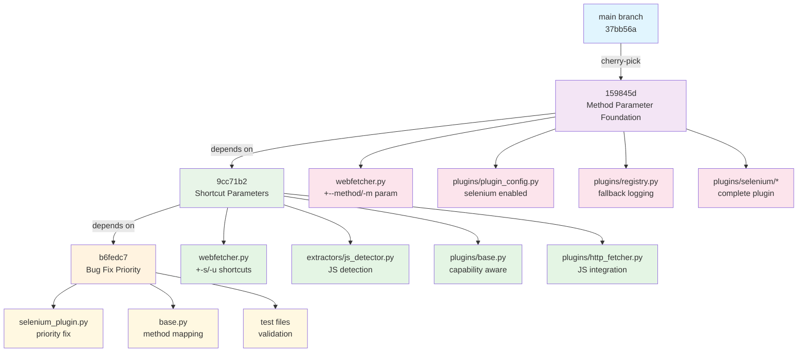

# Parameter System Dependency Graph
## Cherry-pick Operation Planning (Phase 1 Task 1.1)

This document provides a visual and technical representation of the dependency relationships between commits in the parameter system implementation.

---

## Visual Dependency Graph



---

## Commit Relationship Matrix

| Commit | Depends On | Provides | Files Modified | Risk Level |
|--------|------------|----------|----------------|------------|
| `159845d` | None (foundation) | Method parameter system | `webfetcher.py`, `plugins/*` | LOW |
| `9cc71b2` | `159845d` | Shortcut parameters | `webfetcher.py`, `extractors/*` | LOW |
| `b6fedc7` | `159845d`, `9cc71b2` | Bug fixes | `plugins/selenium/*` | VERY LOW |

---

## File Modification Impact Analysis

### Core System Files

#### `webfetcher.py` (Primary Integration Point)
```
159845d: Lines ~4950-5000 (argument parser section)
  ├── Add --method/-m parameter
  ├── Add --no-fallback parameter  
  ├── Add method selection logic
  └── Add plugin preference setting

9cc71b2: Lines ~5000-5040 (parameter handling)
  ├── Add -s/--selenium parameter
  ├── Add -u/--urllib parameter
  ├── Add conflict resolution logic
  └── Add parameter validation

Dependencies: Sequential modification required
Conflict Risk: MEDIUM (same file section)
Resolution: Merge argument definitions, preserve conflict logic
```

#### Plugin System Files

```
plugins/plugin_config.py (159845d)
  └── Enable selenium plugin by default
      Risk: LOW (configuration only)

plugins/registry.py (159845d) 
  └── Add fallback logging integration
      Risk: LOW (logging enhancement)

plugins/base.py (9cc71b2, b6fedc7)
  ├── 9cc71b2: Add capability-aware fallback
  └── b6fedc7: Add method name mapping
      Risk: LOW (additive changes)

plugins/selenium/selenium_plugin.py (b6fedc7)
  └── Fix hardcoded priority property
      Risk: VERY LOW (single line change)
```

### New Components

```
plugins/selenium/* (159845d)
  ├── __init__.py
  ├── chrome_manager.py
  ├── config.py
  └── selenium_plugin.py
      Risk: NONE (new files, no conflicts)

extractors/js_detector.py (9cc71b2)
  └── JavaScript detection system  
      Risk: NONE (new file, no conflicts)

tests/* (all commits)
  └── Various validation frameworks
      Risk: NONE (test files, isolated)
```

---

## Integration Architecture

### Parameter Processing Flow

```
User Input → Argument Parser → Conflict Detection → Method Selection → Plugin System
     ↓              ↓               ↓                ↓                 ↓
CLI Args    --method/-m        -s/-u validation    method_choice    set_preferences()
            -s/--selenium      mutual exclusion    resolution       plugin priority
            -u/--urllib        override warnings   fallback logic   capability check
            --no-fallback      error messages      final method     execution
```

### Plugin System Integration Points

```
webfetcher.py
    ├── set_user_fetch_preferences(method, no_fallback)
    ├── Plugin Registry
    │   ├── HTTPFetcherPlugin (urllib mode)
    │   ├── SeleniumFetcherPlugin (selenium mode)  
    │   └── Auto fallback logic
    └── Capability Detection
        ├── JavaScript requirement detection
        ├── Plugin availability check
        └── Intelligent fallback decisions
```

---

## Cherry-pick Sequence Planning

### Stage 1: Foundation (159845d)
**Objective**: Establish method parameter infrastructure

**Changes Applied**:
- Core argument parser modifications
- Plugin configuration updates  
- Registry fallback integration
- Complete selenium plugin implementation

**Validation Gates**:
- [ ] `--method` parameter functional
- [ ] `-m` shortcut operational
- [ ] Method choices validation working
- [ ] Plugin system integration confirmed

**Potential Conflicts**:
- Argument parser section (high probability)
- Plugin import paths (medium probability)
- Configuration merge (low probability)

### Stage 2: Enhancement (9cc71b2)
**Objective**: Add shortcut parameters and conflict resolution

**Dependencies**: Requires Stage 1 completion

**Changes Applied**:
- Shortcut parameter definitions (-s/-u)
- Parameter conflict detection logic
- JavaScript detection system integration
- Enhanced plugin capability awareness

**Validation Gates**:
- [ ] `-s`/`-u` parameters functional
- [ ] Conflict detection working
- [ ] Parameter override logic operational  
- [ ] JavaScript detection integrated

**Potential Conflicts**:
- Parameter handling logic (medium probability)
- Import chain modifications (low probability)

### Stage 3: Stabilization (b6fedc7)
**Objective**: Apply critical bug fixes

**Dependencies**: Requires Stage 1 and Stage 2 completion

**Changes Applied**:
- Selenium plugin priority fix
- Method name mapping for statistics
- Enhanced validation frameworks

**Validation Gates**:
- [ ] Plugin priority system working
- [ ] Method statistics correct
- [ ] No functional regressions
- [ ] End-to-end parameter testing successful

**Potential Conflicts**:
- Minimal (isolated bug fixes)

---

## Rollback Strategy

### Level 1: Individual Commit Rollback
```bash
# Revert specific commit while preserving others
git revert b6fedc7  # Remove bug fix only
git revert 9cc71b2  # Remove shortcuts only  
git revert 159845d  # Remove entire parameter system
```

### Level 2: Sequential Rollback
```bash
# Remove in reverse dependency order
git revert HEAD      # Remove latest (b6fedc7)
git revert HEAD~1    # Remove shortcuts (9cc71b2)
git revert HEAD~2    # Remove foundation (159845d)
```

### Level 3: Complete Rollback
```bash
# Nuclear option - return to pre-cherry-pick state
git reset --hard backup-before-params-YYYYMMDD-HHMMSS
```

---

## Conflict Resolution Procedures

### High-Probability Conflicts

#### webfetcher.py Argument Parser Section
```python
# Conflict Pattern:
<<<<<<< HEAD
    ap.add_argument('--existing-param', ...)
    args = ap.parse_args()
=======
    ap.add_argument('--method', '-m', ...)
    ap.add_argument('-s', '--selenium', ...)
    ap.add_argument('-u', '--urllib', ...)
    ap.add_argument('--no-fallback', ...)
    # Handle parameter conflicts...
    args = ap.parse_args()
>>>>>>> cherry-pick-commit

# Resolution Strategy:
1. Preserve all existing parameters
2. Add new parameters before parse_args()
3. Add conflict handling after parse_args()
4. Maintain original parameter order where possible
```

#### Plugin System Integration
```python
# Conflict Pattern:
<<<<<<< HEAD
    # Original plugin handling
=======
    # New plugin preference system
    set_user_fetch_preferences(method, no_fallback)
>>>>>>> cherry-pick-commit

# Resolution Strategy:
1. Ensure set_user_fetch_preferences function exists
2. Add conditional call based on parameter availability
3. Maintain backward compatibility for missing parameters
```

### Low-Probability Conflicts

#### Import Statement Conflicts
- **Resolution**: Use conditional imports with try/except
- **Fallback**: Import only if module exists
- **Validation**: Test import chain after resolution

#### Configuration File Conflicts
- **Resolution**: Merge configuration sections
- **Priority**: Preserve user-modified settings
- **Validation**: Verify plugin availability after merge

---

## Success Metrics

### Technical Validation
- [ ] All three commits applied successfully
- [ ] No syntax errors in webfetcher.py
- [ ] Parameter system functional end-to-end
- [ ] Plugin system integration working
- [ ] No regression in existing functionality

### Functional Validation  
- [ ] `--method` parameter accepts valid choices
- [ ] `-s`/`-u` shortcuts work correctly
- [ ] Parameter conflicts detected and handled
- [ ] Plugin priority system operational
- [ ] JavaScript detection system functional

### Integration Validation
- [ ] Real URL fetching with each parameter mode
- [ ] Plugin fallback behavior confirmed
- [ ] Error handling working correctly
- [ ] Statistics and logging functional
- [ ] Performance impact within acceptable range

---

**Dependency Analysis Complete**: Ready for cherry-pick execution

*Phase 1 Task 1.1 deliverable - Parameter System Dependency Graph*