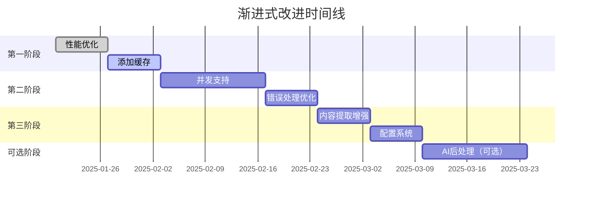

# 渐进式改进实施方案

**版本**: 1.0  
**日期**: 2025-01-19  
**架构师**: Archy-Principle-Architect  
**优先级**: 高

---

## 1. 方案概述

基于架构评估，本方案提供一个务实的、低风险的改进路径，通过小步快跑的方式提升系统性能和功能。

### 核心原则

1. **保持简单** - 不增加不必要的复杂度
2. **向后兼容** - 所有改进不破坏现有功能
3. **可度量** - 每个改进都有明确的指标
4. **快速交付** - 每个阶段1-2周内完成

---

## 2. 改进路线图



---

## 3. 第一阶段：核心性能优化（第1-2周）

### 3.1 添加智能缓存系统

#### 规范定义

```python
from typing import Optional, Dict, Any
from datetime import datetime, timedelta
import hashlib
import json
from pathlib import Path

class CacheSpecification:
    """缓存系统规范"""
    
    # 缓存策略
    CACHE_STRATEGIES = {
        "url_based": "基于URL的缓存键",
        "content_based": "基于内容哈希的缓存键",
        "time_based": "基于时间的失效策略"
    }
    
    # 缓存配置
    DEFAULT_CONFIG = {
        "enabled": True,
        "ttl": 3600,  # 1小时
        "max_size": 1000,  # 最大缓存条目
        "storage": "file",  # file | memory
        "cache_dir": ".webfetcher_cache"
    }
    
    # 接口定义
    class ICacheManager:
        def get(self, url: str) -> Optional[Dict[str, Any]]:
            """获取缓存内容"""
            pass
        
        def set(self, url: str, content: Dict[str, Any]) -> bool:
            """设置缓存"""
            pass
        
        def invalidate(self, url: str) -> bool:
            """使缓存失效"""
            pass
        
        def clear(self) -> int:
            """清除所有缓存"""
            pass
```

#### 测试规范

```python
# tests/test_cache.py
import pytest
from webfetcher_cache import CacheManager

def test_cache_hit_improves_performance():
    """验证缓存命中能提升性能"""
    cache = CacheManager()
    
    # 第一次请求 - 无缓存
    start = time.time()
    result1 = fetch_with_cache(url, cache)
    time1 = time.time() - start
    
    # 第二次请求 - 有缓存
    start = time.time()
    result2 = fetch_with_cache(url, cache)
    time2 = time.time() - start
    
    # 断言
    assert result1 == result2  # 结果一致
    assert time2 < time1 * 0.1  # 快10倍以上

def test_cache_ttl_expiration():
    """验证TTL过期机制"""
    cache = CacheManager(ttl=1)  # 1秒过期
    
    cache.set("test_url", {"data": "test"})
    assert cache.get("test_url") is not None
    
    time.sleep(2)
    assert cache.get("test_url") is None  # 已过期

def test_cache_size_limit():
    """验证缓存大小限制"""
    cache = CacheManager(max_size=3)
    
    for i in range(5):
        cache.set(f"url_{i}", {"data": i})
    
    # 只保留最近的3个
    assert len(cache.list_keys()) == 3
```

### 3.2 连接池和会话复用

#### 规范定义

```python
class ConnectionPoolSpecification:
    """连接池规范"""
    
    # 配置参数
    POOL_CONFIG = {
        "max_connections": 10,
        "max_keepalive": 30,
        "timeout": 30,
        "retry_count": 3,
        "backoff_factor": 0.3
    }
    
    # 接口定义
    class IConnectionPool:
        def get_session(self) -> requests.Session:
            """获取可复用的会话"""
            pass
        
        def release_session(self, session: requests.Session):
            """释放会话回池"""
            pass
        
        def close_all(self):
            """关闭所有连接"""
            pass
```

---

## 4. 第二阶段：并发和容错（第3-4周）

### 4.1 异步并发支持

#### 规范定义

```python
import asyncio
from typing import List, Dict, Any, Callable

class ConcurrencySpecification:
    """并发处理规范"""
    
    # 并发配置
    CONCURRENCY_CONFIG = {
        "max_workers": 5,
        "queue_size": 100,
        "timeout_per_task": 30,
        "rate_limit": 10  # 每秒最大请求数
    }
    
    # 接口定义
    class IConcurrentFetcher:
        async def fetch_multiple(
            self, 
            urls: List[str],
            callback: Optional[Callable] = None
        ) -> List[Dict[str, Any]]:
            """并发抓取多个URL"""
            pass
        
        async def fetch_with_retry(
            self,
            url: str,
            max_retries: int = 3
        ) -> Dict[str, Any]:
            """带重试的抓取"""
            pass
```

#### 测试场景

```python
# tests/test_concurrency.py
import pytest
import asyncio

@pytest.mark.asyncio
async def test_concurrent_fetch_performance():
    """验证并发抓取性能提升"""
    urls = [f"https://example.com/page{i}" for i in range(10)]
    
    # 串行执行
    start = time.time()
    results_serial = []
    for url in urls:
        results_serial.append(await fetch_single(url))
    time_serial = time.time() - start
    
    # 并发执行
    start = time.time()
    results_concurrent = await fetch_multiple(urls)
    time_concurrent = time.time() - start
    
    # 验证
    assert len(results_concurrent) == len(results_serial)
    assert time_concurrent < time_serial * 0.3  # 至少快3倍

@pytest.mark.asyncio
async def test_rate_limiting():
    """验证速率限制"""
    fetcher = ConcurrentFetcher(rate_limit=5)  # 每秒5个
    
    start = time.time()
    await fetcher.fetch_multiple([f"url_{i}" for i in range(10)])
    elapsed = time.time() - start
    
    # 10个请求，每秒5个，应该需要约2秒
    assert 1.8 < elapsed < 2.5
```

### 4.2 智能错误恢复

#### 规范定义

```python
class ErrorRecoverySpecification:
    """错误恢复规范"""
    
    # 错误分类
    ERROR_CATEGORIES = {
        "network": ["timeout", "connection_error"],
        "server": ["500", "502", "503"],
        "client": ["400", "401", "403", "404"],
        "parsing": ["invalid_html", "encoding_error"]
    }
    
    # 恢复策略
    RECOVERY_STRATEGIES = {
        "network": "exponential_backoff_retry",
        "server": "wait_and_retry",
        "client": "skip_or_alternative",
        "parsing": "fallback_parser"
    }
    
    # 接口定义
    class IErrorHandler:
        def handle_error(
            self,
            error: Exception,
            context: Dict[str, Any]
        ) -> Dict[str, Any]:
            """处理错误并尝试恢复"""
            pass
        
        def get_fallback_strategy(
            self,
            error_type: str
        ) -> Callable:
            """获取降级策略"""
            pass
```

---

## 5. 第三阶段：功能增强（第5-6周）

### 5.1 内容提取算法改进

#### 规范定义

```python
class ContentExtractionSpecification:
    """内容提取增强规范"""
    
    # 提取算法
    EXTRACTION_ALGORITHMS = [
        "dom_distance",  # DOM距离算法
        "text_density",  # 文本密度算法
        "visual_blocks",  # 视觉块算法
        "machine_learning"  # ML模型（可选）
    ]
    
    # 质量评分
    class IQualityScorer:
        def score_content(
            self,
            content: str,
            metadata: Dict[str, Any]
        ) -> float:
            """评分内容质量 (0-1)"""
            pass
        
        def filter_noise(
            self,
            content: str,
            threshold: float = 0.5
        ) -> str:
            """过滤噪音内容"""
            pass
```

### 5.2 配置系统

#### 规范定义

```yaml
# webfetcher_config.yaml
webfetcher:
  # 基础配置
  general:
    timeout: 30
    user_agent: "Mozilla/5.0..."
    
  # 性能配置
  performance:
    cache_enabled: true
    cache_ttl: 3600
    max_concurrent: 5
    connection_pool_size: 10
    
  # 渲染配置
  rendering:
    default_mode: "auto"  # auto | static | playwright
    playwright_timeout: 90
    
  # 站点特定配置
  sites:
    wechat:
      parser: "wechat"
      render: false
    xiaohongshu:
      parser: "xhs"
      render: true
    default:
      parser: "generic"
      render: false
      
  # 输出配置
  output:
    format: "markdown"
    include_metadata: true
    download_assets: false
```

---

## 6. 可选阶段：AI后处理（第7-8周）

### 6.1 轻量级AI集成

#### 规范定义

```python
class AIPostProcessorSpecification:
    """AI后处理规范（可选功能）"""
    
    # 使用场景
    AI_USE_CASES = {
        "summarize": "生成内容摘要",
        "translate": "翻译内容",
        "answer": "回答特定问题",
        "extract": "提取特定信息"
    }
    
    # 接口定义
    class IAIProcessor:
        def process(
            self,
            content: str,
            task: str,
            prompt: Optional[str] = None
        ) -> str:
            """AI处理内容"""
            pass
        
        def should_use_ai(
            self,
            context: Dict[str, Any]
        ) -> bool:
            """判断是否需要AI处理"""
            pass
```

#### 实施条件

```python
# AI功能仅在以下条件启用
AI_ACTIVATION_CONDITIONS = {
    "user_explicit_request": True,  # 用户明确要求
    "cost_acceptable": lambda tokens: tokens * 0.002 < 1.0,  # 成本<$1
    "content_suitable": lambda content: len(content) < 10000,  # 内容不太长
    "api_available": True  # API可用
}
```

---

## 7. 验收标准

### 7.1 性能指标

| 指标 | 当前值 | 目标值 | 测量方法 |
|-----|--------|--------|---------|
| 平均响应时间 | 3.4秒 | <1.5秒 | 性能测试 |
| 缓存命中率 | 0% | >60% | 监控统计 |
| 并发处理能力 | 1 | 10 | 负载测试 |
| 错误恢复率 | 60% | >90% | 错误注入测试 |

### 7.2 功能验收

```python
# acceptance_tests.py
def test_performance_improvement():
    """验收性能改进"""
    # 测试缓存效果
    assert cache_hit_rate() > 0.6
    
    # 测试并发能力
    assert concurrent_capacity() >= 10
    
    # 测试平均响应时间
    assert average_response_time() < 1.5

def test_backward_compatibility():
    """验收向后兼容性"""
    # 所有现有命令行参数仍然有效
    old_commands = load_old_commands()
    for cmd in old_commands:
        assert execute_command(cmd).success
    
    # 输出格式保持一致
    assert output_format_unchanged()
```

---

## 8. 实施检查清单

### 第一阶段检查清单

- [ ] 缓存系统实现
  - [ ] 文件缓存实现
  - [ ] TTL机制
  - [ ] 大小限制
  - [ ] 单元测试
- [ ] 连接池实现
  - [ ] Session复用
  - [ ] 连接管理
  - [ ] 性能测试
- [ ] 文档更新
  - [ ] 使用说明
  - [ ] 配置示例

### 第二阶段检查清单

- [ ] 并发支持
  - [ ] asyncio集成
  - [ ] 速率限制
  - [ ] 队列管理
  - [ ] 并发测试
- [ ] 错误处理
  - [ ] 错误分类
  - [ ] 恢复策略
  - [ ] 降级机制
  - [ ] 容错测试

### 第三阶段检查清单

- [ ] 内容提取
  - [ ] 算法改进
  - [ ] 质量评分
  - [ ] 噪音过滤
  - [ ] 准确性测试
- [ ] 配置系统
  - [ ] YAML配置
  - [ ] 站点配置
  - [ ] 配置验证
  - [ ] 配置测试

---

## 9. 风险管理

### 风险矩阵

| 风险 | 概率 | 影响 | 缓解措施 |
|-----|-----|------|---------|
| 缓存污染 | 低 | 中 | 验证机制+TTL |
| 并发过载 | 中 | 高 | 速率限制+队列 |
| 兼容性问题 | 低 | 高 | 完整测试+渐进部署 |
| 性能退化 | 低 | 中 | 性能监控+快速回滚 |

---

## 10. 总结

本渐进式改进方案提供了一个务实、低风险、高收益的系统优化路径。通过分阶段实施，我们能够：

1. **快速见效** - 第一阶段即可看到性能提升
2. **风险可控** - 每个改进都经过充分测试
3. **成本可控** - 无需额外基础设施
4. **维护简单** - 保持系统简洁性

遵循"渐进式胜过大爆炸"的架构原则，我们能够在不破坏现有系统稳定性的前提下，持续改进系统性能和功能。

---

**架构师**: Archy-Principle-Architect  
**批准日期**: 2025-01-19  
**实施状态**: 待启动