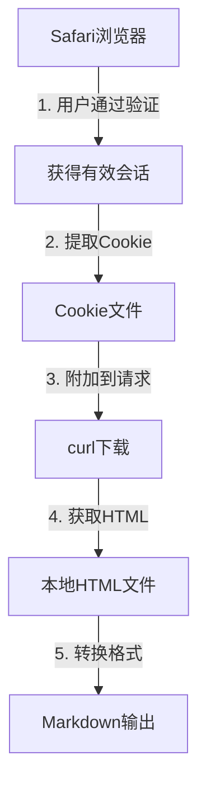

# Safari Cookie复用快速使用指南

## 概述
本工具帮助您利用Safari浏览器中已验证的会话来下载中央纪委网站的内容，绕过验证码限制。

## 前置条件
- macOS系统
- Safari浏览器
- Python 3.6+
- webfetcher.py工具

## 快速开始

### 第1步：在Safari中通过验证
1. 打开Safari浏览器
2. 访问 https://www.ccdi.gov.cn
3. 完成验证码验证
4. 确认可以正常浏览文章内容

### 第2步：启用Safari开发者菜单
```bash
# 在终端运行（只需运行一次）
defaults write com.apple.Safari IncludeDevelopMenu -bool true
defaults write com.apple.Safari ShowDevelopMenu -bool true
```

重启Safari后，菜单栏会出现"开发"菜单。

### 第3步：提取Cookie

#### 方法A：自动提取（推荐）
```bash
# 确保Safari正在显示已验证的ccdi.gov.cn页面
python quick_safari_cookie_solution.py --extract --auto
```

#### 方法B：手动提取
```bash
python quick_safari_cookie_solution.py --extract
```

按照提示操作：
1. 在Safari中打开开发者工具（Command+Option+I）
2. 切换到Network标签
3. 刷新页面（Command+R）
4. 找到主文档请求（通常是第一个）
5. 右键 → Copy → Copy as cURL
6. 粘贴到终端

### 第4步：下载内容

#### 下载单个文章
```bash
python quick_safari_cookie_solution.py --download "https://www.ccdi.gov.cn/yaowenn/202509/t20250904_445401.html"
```

#### 批量下载
创建URL列表文件 `urls.txt`：
```
https://www.ccdi.gov.cn/yaowenn/202509/t20250904_445401.html
https://www.ccdi.gov.cn/yaowenn/202509/t20250903_445321.html
https://www.ccdi.gov.cn/toutiaon/202509/t20250902_445231.html
```

运行批量下载：
```bash
python quick_safari_cookie_solution.py --batch urls.txt
```

## 高级用法

### 检查Cookie有效性
```bash
python quick_safari_cookie_solution.py --check
```

### 直接使用curl命令
如果您已经提取了Cookie，可以直接使用curl：
```bash
# Cookie保存在 ~/.wf_safari_cookies/cookies.txt
curl -H "Cookie: $(cat ~/.wf_safari_cookies/cookies.txt)" \
     -H "User-Agent: Mozilla/5.0 (Macintosh; Intel Mac OS X 10_15_7)" \
     "https://www.ccdi.gov.cn/yaowenn/202509/t20250904_445401.html" \
     -o article.html

# 转换为Markdown
python webfetcher.py file://$(pwd)/article.html -o article.md
```

### 创建别名快捷命令
将以下内容添加到 `~/.bashrc` 或 `~/.zshrc`：
```bash
# CCDI下载快捷命令
alias ccdi-extract='python ~/path/to/quick_safari_cookie_solution.py --extract --auto'
alias ccdi-download='python ~/path/to/quick_safari_cookie_solution.py --download'
alias ccdi-check='python ~/path/to/quick_safari_cookie_solution.py --check'

# 使用示例
ccdi-download "https://www.ccdi.gov.cn/yaowenn/202509/t20250904_445401.html"
```

## 常见问题

### Q: Cookie多久会过期？
A: 通常在30分钟到2小时之间，取决于网站设置。建议定期检查有效性。

### Q: 提示"检测到验证页面"怎么办？
A: Cookie已失效，需要：
1. 重新在Safari中访问网站并通过验证
2. 重新提取Cookie
3. 再次尝试下载

### Q: AppleScript自动提取失败？
A: 可能的原因：
- Safari未打开或未在ccdi.gov.cn页面
- 系统隐私设置阻止了AppleScript
- 需要在系统偏好设置中允许终端控制Safari

解决方法：
1. 系统偏好设置 → 安全性与隐私 → 隐私
2. 选择"辅助功能"或"自动化"
3. 勾选终端/Terminal对Safari的控制权限

### Q: 下载的内容是乱码？
A: 网站使用UTF-8编码，确保：
1. 终端编码设置为UTF-8
2. 文本编辑器正确识别编码
3. 使用webfetcher处理可自动处理编码问题

### Q: 可以用于其他需要验证的网站吗？
A: 可以，但需要：
1. 修改脚本中的域名检查
2. 调整Cookie提取逻辑
3. 可能需要额外的请求头

## 工作原理



## 输出位置

- Cookie文件：`~/.wf_safari_cookies/`
- 下载内容：`./ccdi_downloads/`
- 日志文件：`./ccdi_downloads/download.log`

## 安全建议

1. **Cookie包含敏感信息**，不要分享给他人
2. **定期清理**过期的Cookie文件
3. **仅用于合法目的**，遵守网站使用条款
4. **控制访问频率**，避免给服务器造成负担

## 故障排除

### 调试模式
查看详细的执行过程：
```bash
# 启用Python调试输出
python -v quick_safari_cookie_solution.py --download <URL>

# 查看curl详细输出
curl -v -H "Cookie: $(cat ~/.wf_safari_cookies/cookies.txt)" <URL>
```

### 清理缓存
```bash
# 清理所有Cookie和临时文件
rm -rf ~/.wf_safari_cookies
rm -rf ./ccdi_downloads/*.html
```

### 重置Safari
如果Safari出现问题：
1. 清除浏览数据：Safari → 清除历史记录
2. 重置开发者设置：Safari → 开发 → 清空缓存
3. 重启Safari

## 进阶定制

### 修改User-Agent
编辑 `quick_safari_cookie_solution.py`，找到User-Agent行：
```python
'-H', 'User-Agent: 您的自定义User-Agent',
```

### 添加代理支持
```bash
# 使用HTTP代理
curl -x http://proxy:port -H "Cookie: ..." <URL>

# 使用SOCKS5代理
curl --socks5 127.0.0.1:1080 -H "Cookie: ..." <URL>
```

### 集成到其他工具
```python
# 在其他Python脚本中使用
import subprocess

def download_ccdi_article(url):
    cmd = [
        'python', 
        'quick_safari_cookie_solution.py', 
        '--download', 
        url
    ]
    result = subprocess.run(cmd, capture_output=True)
    return result.returncode == 0
```

## 更新日志

- **v1.0.0** (2025-09-23)
  - 初始版本
  - 支持手动和自动Cookie提取
  - 单个和批量下载功能
  - Cookie有效性检查

## 获取帮助

如遇到问题，请：
1. 查看本指南的常见问题部分
2. 检查Cookie是否有效
3. 确认Safari可以正常访问网站
4. 查看错误日志

---

**注意**：本工具仅供学习和研究使用，请遵守相关法律法规和网站服务条款。