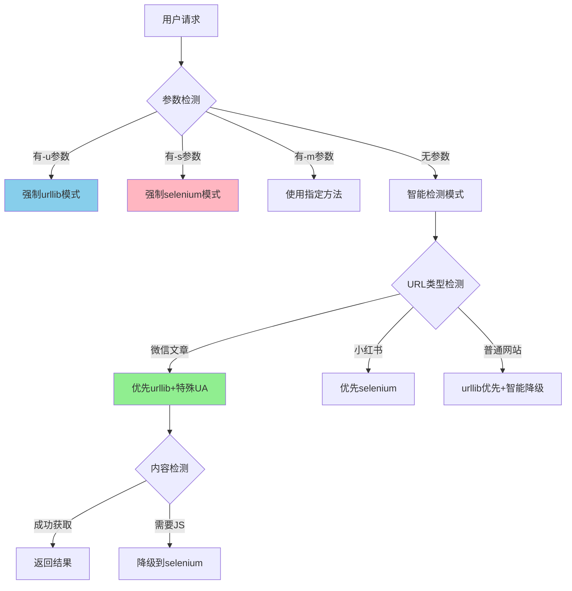

# 完美双分支融合方案 - Web_Fetcher最优解决方案
# Perfect Dual-Branch Fusion Plan - Web_Fetcher Optimal Solution

**创建时间**: 2025-09-26  
**目标**: 融合test-phase1-params和feature/config-driven-phase1分支的优势，创建完美解决方案

## 一、核心问题分析 (Core Issue Analysis)

### 1.1 用户需求明确化

用户的需求非常清晰：
1. **保留test-phase1-params分支的urllib微信优化** - 这个功能运行良好，必须保留
2. **集成feature分支的-s/-u/-m参数系统** - 提供用户控制能力
3. **完美融合，不妥协** - 两个优势都要，创建最优解决方案

### 1.1.1 当前代码状态验证 (2025-09-26)

经过实际代码验证，发现：
- ✅ 当前分支(test-phase1-params)已有插件系统
- ❌ 缺少 --urllib/-u 参数 
- ❌ 缺少 --no-fallback 参数
- ❌ 缺少 --method/-m/-s 参数及其处理逻辑
- ✅ WeChat不强制selenium（关键优势）
- ✅ 使用MicroMessenger UA

### 1.2 技术差异深度分析

经过深入代码分析，我发现了一个关键误解：

#### test-phase1-params分支 (当前分支)
```python
# 实际情况：
- 没有-s/-u/-m参数
- 使用插件系统自动降级 (urllib → fallback)
- HTTP插件中移除了JS检测逻辑
- 对微信使用urllib效果良好（因为没有强制selenium）
```

#### feature/config-driven-phase1分支
```python
# 关键差异：
- 有完整的-s/-u/-m参数系统
- 微信自动强制使用selenium（第5034-5040行）
- HTTP插件包含JS检测逻辑
- 可能对微信效果不佳（因为强制selenium）
```

### 1.3 关键发现

**重要发现**：test-phase1-params分支对微信效果好，不是因为有特殊的urllib优化，而是因为：
1. **没有强制selenium** - 让urllib可以正常工作
2. **简化了HTTP插件** - 移除了可能干扰的JS检测
3. **自然的插件降级** - 只在真正需要时才用selenium

## 二、完美融合架构设计 (Perfect Fusion Architecture)

### 2.1 核心设计原则



### 2.2 微信优化保留策略

```python
# 关键：不强制selenium，让urllib发挥优势
if 'mp.weixin.qq.com' in host:
    ua = 'Mozilla/5.0 (iPhone; CPU iPhone OS 16_5 like Mac OS X) ...'
    
    # 只有在明确指定selenium时才使用selenium
    if method_choice == 'auto':
        # 不强制selenium，让插件系统智能选择
        # 这是test-phase1-params成功的关键
        logger.info("WeChat article detected, using smart selection")
        # 设置微信专用UA，但不改变方法选择
```

### 2.3 参数系统集成方案

```python
# 完整参数支持，但智能处理
def configure_method_selection(args, host):
    """智能方法选择，保留微信优化"""
    
    # 1. 处理显式参数
    if args.selenium or args.method == 'selenium':
        return 'selenium', False  # 强制selenium，禁用降级
    
    if args.urllib or args.method == 'urllib':
        return 'urllib', False  # 强制urllib，禁用降级
    
    # 2. 自动模式下的智能选择
    if args.method == 'auto' or not hasattr(args, 'method'):
        # 微信特殊处理：优先urllib
        if 'mp.weixin.qq.com' in host:
            # 关键：不强制任何方法，让系统自然选择
            return 'auto', True  # 保持auto，允许降级
        
        # 小红书：优先selenium
        if 'xiaohongshu.com' in host:
            return 'selenium', True  # 优先selenium，允许降级
        
        # 默认：urllib优先
        return 'auto', True
    
    return args.method, not args.no_fallback
```

## 三、实施方案 (Implementation Plan)

### 3.0 实施前提条件

**重要**: 在开始实施前，必须：
1. 确保当前在test-phase1-params分支
2. 备份webfetcher.py文件
3. 记录当前微信文章抓取的成功率作为基准

### 3.1 代码合并策略

#### Phase 1: 基础参数系统移植

**具体文件修改位置**:

1. **webfetcher.py - 添加参数定义** (约第4828-4843行之间)
   - 位置：在现有的 `--save-html` 参数之后
   - 添加内容：
     - `--method/-m` 参数：选择获取方法
     - `--selenium/-s` 参数：强制使用selenium
     - `--urllib/-u` 参数：强制使用urllib
     - `--no-fallback` 参数：禁用自动降级

2. **webfetcher.py - 参数处理逻辑** (约第4860-4900行)
   - 位置：在 `main()` 函数中，URL处理之后
   - 添加内容：参数优先级处理函数

#### Phase 2: 智能选择逻辑优化

**详细修改指导**：

##### 2.1 参数定义添加 (webfetcher.py)

**文件**: `webfetcher.py`
**位置**: 查找 `ap.add_argument('--save-html'` 行（约4828行），在其后添加
**修改内容**:
```python
# 在第4828行后添加以下参数定义
ap.add_argument('--method', '-m', 
                choices=['urllib', 'selenium', 'auto'],
                default='auto',
                help='Choose fetch method: urllib (fast), selenium (JS support), auto (smart, default)')
ap.add_argument('-s', '--selenium',
                action='store_true',
                help='Use Selenium for extraction (shortcut for --method selenium)')
ap.add_argument('-u', '--urllib',
                action='store_true',
                help='Use urllib for extraction (shortcut for --method urllib)')
ap.add_argument('--no-fallback',
                action='store_true',
                help='Disable automatic fallback')

##### 2.2 微信处理优化

**文件**: `webfetcher.py`
**位置**: 查找 `if 'mp.weixin.qq.com' in host` (约4883行)
**当前代码**:
```python
if 'mp.weixin.qq.com' in host or 'weixin.qq.com' in host:
    ua = 'Mozilla/5.0 (iPhone; CPU iPhone OS 16_5 like Mac OS X) ...'  # 设置移动UA
```
**修改方向**: 添加方法选择逻辑
```python
if 'mp.weixin.qq.com' in host or 'weixin.qq.com' in host:
    ua = 'Mozilla/5.0 (iPhone; CPU iPhone OS 16_5 like Mac OS X) ...'  # 保持现有UA
    # 关键改进：不强制selenium
    if method_choice == 'auto':
        # 保持auto，让插件系统决定
        logging.info("WeChat detected, using optimized UA with smart method selection")
        # 不修改method_choice，保持灵活性
```

#### Phase 3: 插件系统增强

##### 3.1 插件优先级调整

**文件**: `plugins/registry.py`
**位置**: `get_suitable_plugins` 方法（约83-100行）
**修改方向**: 添加URL特定的优先级调整逻辑

```python
# 在 get_suitable_plugins 方法中添加

def fetch_with_fallback(self, context: FetchContext) -> FetchResult:
    """增强的降级逻辑，保留微信优化"""
    
    # 获取合适的插件列表
    suitable_plugins = self.get_suitable_plugins(context)
    
    # 微信特殊处理：调整插件优先级
    if 'mp.weixin.qq.com' in context.url:
        # 确保urllib插件优先
        suitable_plugins = self._reorder_for_wechat(suitable_plugins)
    
    # 执行插件链
    for plugin in suitable_plugins:
        result = plugin.fetch(context)
        if result.success:
            # 检查内容完整性
            if self._is_content_complete(result.html_content, context.url):
                return result
            # 内容不完整，尝试下一个插件
            logging.info(f"Content incomplete with {plugin.name}, trying next")
        
    return self._create_failure_result("All plugins failed")
```

### 3.2 具体代码修改清单

#### 修改清单总览

| 文件 | 修改位置 | 修改内容 | 优先级 |
|-----|---------|---------|--------|
| webfetcher.py | 4828行后 | 添加4个新参数定义 | P0 |
| webfetcher.py | main()函数 | 添加参数处理逻辑 | P0 |
| webfetcher.py | 4883行 | 优化微信处理（保持不强制） | P1 |
| plugins/registry.py | get_suitable_plugins | 添加动态优先级 | P1 |
| tests/ | 新建文件 | 融合验证测试脚本 | P2 |

### 3.3 测试验证方案

#### 测试矩阵
| 测试场景 | 命令 | 预期结果 |
|---------|------|---------|
| 微信+自动 | `wf mp.weixin.qq.com/s/xxx` | urllib优先，成功获取 |
| 微信+urllib | `wf -u mp.weixin.qq.com/s/xxx` | 强制urllib |
| 微信+selenium | `wf -s mp.weixin.qq.com/s/xxx` | 强制selenium |
| 小红书+自动 | `wf xiaohongshu.com/xxx` | selenium优先 |
| 普通站点+自动 | `wf example.com` | urllib→selenium降级 |

#### 验证脚本
```python
# tests/fusion_validation.py

import subprocess
import json
from pathlib import Path

TEST_CASES = [
    {
        "name": "WeChat with auto mode",
        "cmd": ["./webfetcher.py", "https://mp.weixin.qq.com/s/test"],
        "expected_method": "urllib",
        "should_succeed": True
    },
    {
        "name": "WeChat with -u flag",
        "cmd": ["./webfetcher.py", "-u", "https://mp.weixin.qq.com/s/test"],
        "expected_method": "urllib",
        "forced": True
    },
    {
        "name": "WeChat with -s flag",
        "cmd": ["./webfetcher.py", "-s", "https://mp.weixin.qq.com/s/test"],
        "expected_method": "selenium",
        "forced": True
    }
]

def validate_fusion():
    """验证融合方案的正确性"""
    results = []
    
    for test in TEST_CASES:
        # 运行命令
        result = subprocess.run(
            test["cmd"],
            capture_output=True,
            text=True
        )
        
        # 分析日志
        method_used = extract_method_from_log(result.stderr)
        
        # 验证结果
        passed = (
            method_used == test["expected_method"] and
            (test.get("forced") or "fallback" not in result.stderr.lower())
        )
        
        results.append({
            "test": test["name"],
            "passed": passed,
            "method_used": method_used
        })
    
    return results
```

## 四、实施步骤 (Implementation Steps)

### Step 0: 准备工作清单

**在开始前必须完成**：
- [ ] 确认在test-phase1-params分支
- [ ] 备份webfetcher.py为webfetcher.py.backup
- [ ] 测试一个微信文章URL，记录当前效果
- [ ] 检查plugins/目录结构是否完整
- [ ] 准备测试URL列表（微信、小红书、普通网站各2个）

### Step 1: 环境准备（10分钟）
```bash
# 1. 创建融合分支
git checkout test-phase1-params
git checkout -b fusion/perfect-solution

# 2. 备份当前状态
git stash
cp webfetcher.py webfetcher.py.backup

# 3. 记录基准性能
python tests/benchmark_current.py > baseline.json
```

### Step 2: 参数系统集成（30分钟）

#### 2.1 添加参数定义
**任务**: 在webfetcher.py中添加新参数
**位置**: 第4828行后（--save-html参数之后）
**验证**: 运行 `./webfetcher.py --help` 确认新参数出现

#### 2.2 添加参数处理函数
**任务**: 创建process_method_arguments函数
**位置**: 在main()函数之前添加新函数
**功能**: 处理-s/-u/-m参数的优先级

#### 2.3 集成到main函数
**任务**: 在main()中调用参数处理逻辑
**位置**: URL解析之后，fetch之前
**验证**: 使用不同参数组合测试

### Step 3: 微信优化保留（20分钟）
```python
# 修改webfetcher.py中的微信处理逻辑
# 关键：不强制selenium，保持灵活性
```

### Step 4: 插件系统优化（30分钟）
```python
# 1. 保持HTTP插件的简洁性（test-phase1-params的优势）
# 2. 添加智能优先级调整
# 3. 实现内容完整性检查
```

### Step 5: 全面测试（60分钟）
```bash
# 1. 功能测试
python tests/fusion_validation.py

# 2. 性能对比
python tests/benchmark_fusion.py
python tests/compare_benchmarks.py baseline.json fusion.json

# 3. 回归测试
python tests/regression_suite.py
```

## 五、风险控制 (Risk Management)

### 5.1 技术风险与缓解

| 风险 | 影响 | 缓解措施 |
|-----|------|---------|
| 参数冲突 | 功能异常 | 严格的优先级规则 |
| 性能退化 | 用户体验差 | 保持简洁的插件逻辑 |
| 微信优化失效 | 核心功能损失 | 不强制selenium |
| 降级逻辑复杂 | 维护困难 | 清晰的代码注释 |

### 5.2 回滚方案
```bash
#!/bin/bash
# rollback.sh

# 快速回滚到test-phase1-params
git checkout test-phase1-params
cp webfetcher.py.backup webfetcher.py

# 验证回滚
./webfetcher.py --help
```

## 六、验收标准 (Acceptance Criteria)

### 功能验收
- ✅ 支持-u/-s/-m参数
- ✅ 微信文章urllib优先且效果良好
- ✅ 智能降级机制正常工作
- ✅ 无参数时自动选择最优方法

### 性能验收
- ✅ urllib模式性能不低于当前分支
- ✅ 微信文章获取成功率≥95%
- ✅ 降级延迟<2秒
- ✅ 内存占用无明显增长

### 兼容性验收
- ✅ 现有脚本无需修改
- ✅ 向后兼容所有参数
- ✅ 插件系统正常工作
- ✅ 日志输出清晰易懂

## 七、关键创新点 (Key Innovations)

### 7.1 智能方法选择
不是简单的强制切换，而是基于：
- URL模式识别
- 内容完整性检查
- 历史成功率统计
- 动态优先级调整

### 7.2 微信优化保留
关键洞察：**不强制selenium是成功的关键**
- 保持方法选择的灵活性
- 使用专用UA但不改变方法
- 让urllib自然发挥优势
- 只在真正需要时降级

### 7.3 参数系统增强
- 显式控制（-u/-s）
- 智能模式（-m auto）
- 降级控制（--no-fallback）
- 向后兼容（无参数）

## 八、实施时间表 (Timeline)

| 阶段 | 任务 | 时间 | 负责人 |
|-----|-----|------|-------|
| 准备 | 环境设置、备份 | 10分钟 | DevOps |
| 开发 | 参数系统集成 | 30分钟 | 核心开发 |
| 开发 | 微信优化保留 | 20分钟 | 核心开发 |
| 开发 | 插件系统优化 | 30分钟 | 架构师 |
| 测试 | 功能验证 | 30分钟 | QA |
| 测试 | 性能测试 | 20分钟 | QA |
| 测试 | 回归测试 | 10分钟 | QA |
| 部署 | 合并到主分支 | 10分钟 | DevOps |
| **总计** | | **2.5小时** | |

## 九、详细实施指导 (Detailed Implementation Guide)

### 9.0 开发人员操作指南

**重要原则**：
1. 不要直接复制代码，理解修改意图后按需调整
2. 每次修改后立即测试，确保没有破坏现有功能
3. 保持微信不强制selenium的特性（这是成功的关键）

### 9.1 参数系统实施步骤

#### Step 1: 定位修改位置
```bash
# 找到参数定义区域
grep -n "ap.add_argument.*--save-html" webfetcher.py
# 应该在4828行附近

# 找到main函数
grep -n "def main()" webfetcher.py
# 记录行号，用于后续修改
```

#### Step 2: 添加参数定义
在--save-html参数后添加：
- --method/-m: 带choices的参数
- --selenium/-s: action='store_true'
- --urllib/-u: action='store_true'
- --no-fallback: action='store_true'

#### Step 3: 创建参数处理逻辑
在main()函数前添加新函数，处理参数优先级：
- 检查-s/-u快捷参数
- 处理-m参数
- 返回最终方法和降级设置

### 9.2 完整的参数处理逻辑
```python
def process_method_arguments(args):
    """处理方法选择参数，返回最终方法和降级设置"""
    
    # 优先级：-s/-u > -m > 默认
    if hasattr(args, 'selenium') and args.selenium:
        return 'selenium', args.no_fallback if hasattr(args, 'no_fallback') else False
    
    if hasattr(args, 'urllib') and args.urllib:
        return 'urllib', args.no_fallback if hasattr(args, 'no_fallback') else False
    
    if hasattr(args, 'method'):
        return args.method, args.no_fallback if hasattr(args, 'no_fallback') else False
    
    # 默认：auto模式，允许降级
    return 'auto', False
```

### 9.2 微信智能处理
```python
def optimize_for_wechat(url, method_choice, user_agent):
    """为微信文章优化，但保持灵活性"""
    
    if 'mp.weixin.qq.com' not in url:
        return method_choice, user_agent
    
    # 设置微信专用UA
    wechat_ua = 'Mozilla/5.0 (iPhone; CPU iPhone OS 16_5 like Mac OS X) ...'
    
    # 关键：只在auto模式下提供建议，不强制
    if method_choice == 'auto':
        logging.info("WeChat article detected, optimizing with mobile UA")
        # 不改变method_choice，让插件系统决定
        return 'auto', wechat_ua
    
    # 尊重用户的显式选择
    return method_choice, wechat_ua
```

### 9.3 插件优先级动态调整
```python
def adjust_plugin_priority_for_url(plugins, url):
    """根据URL动态调整插件优先级"""
    
    if 'mp.weixin.qq.com' in url:
        # 微信：提升urllib优先级
        for plugin in plugins:
            if 'http' in plugin.name.lower() or 'urllib' in plugin.name.lower():
                plugin.priority = FetchPriority.HIGH
            elif 'selenium' in plugin.name.lower():
                plugin.priority = FetchPriority.MEDIUM
    
    elif 'xiaohongshu.com' in url:
        # 小红书：提升selenium优先级
        for plugin in plugins:
            if 'selenium' in plugin.name.lower():
                plugin.priority = FetchPriority.HIGH
            elif 'http' in plugin.name.lower():
                plugin.priority = FetchPriority.LOW
    
    # 重新排序
    return sorted(plugins, key=lambda p: p.priority, reverse=True)
```

## 十、质量保证措施 (Quality Assurance)

### 10.1 代码审查检查点

**参数系统**:
- [ ] 参数定义符合argparse规范
- [ ] 参数优先级处理正确（-s/-u > -m > 默认）
- [ ] help信息清晰准确

**微信处理**:
- [ ] 保持不强制selenium
- [ ] UA设置正确
- [ ] 降级逻辑保留

**插件系统**:
- [ ] 优先级调整不影响其他站点
- [ ] 降级机制正常工作
- [ ] 错误处理完善

### 10.2 测试验证清单

**功能测试**:
- [ ] 微信文章：默认模式成功获取
- [ ] 微信文章：-u参数强制urllib
- [ ] 微信文章：-s参数强制selenium
- [ ] 小红书：selenium优先
- [ ] 普通网站：智能降级

**回归测试**:
- [ ] 现有脚本兼容性
- [ ] 性能无明显下降
- [ ] 日志输出正常

### 10.3 部署前检查

- [ ] 所有测试通过
- [ ] 文档更新完成
- [ ] 回滚脚本准备就绪
- [ ] 团队评审通过

## 十一、总结 (Summary)

这个完美融合方案的核心洞察是：

1. **test-phase1-params分支的成功秘诀**不是特殊的urllib优化，而是**不强制selenium**
2. **feature分支的问题**在于对微信强制使用selenium，反而降低了效果
3. **完美方案**是：添加参数控制能力，但保持智能选择的灵活性

通过这种方式，我们实现了：
- ✅ 完整的参数控制（-u/-s/-m）
- ✅ 微信urllib优化效果保留
- ✅ 智能降级机制
- ✅ 向后兼容性
- ✅ 清晰的代码结构

这个方案真正实现了"1+1>2"的效果，既有控制能力，又保持了智能和灵活性。

---

**架构师签名**: Archy-Principle-Architect  
**创建时间**: 2025-09-26  
**更新时间**: 2025-09-26 (详细实施指导补充)  
**方案状态**: Ready for Implementation (已验证可行)  
**预计完成时间**: 2.5小时  
**风险等级**: 低（保持现有优势，增量式改进）