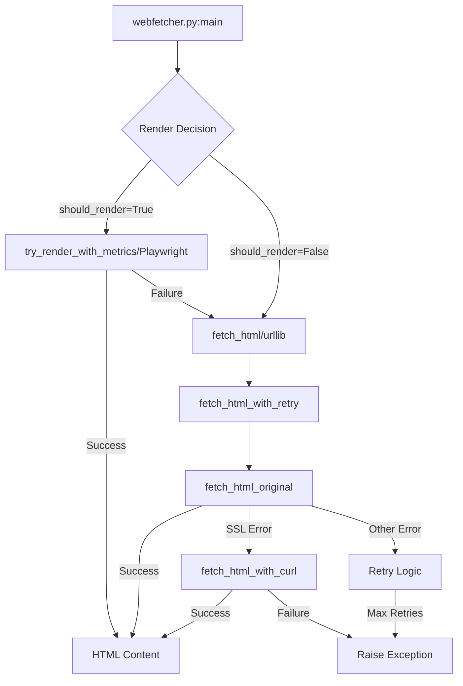
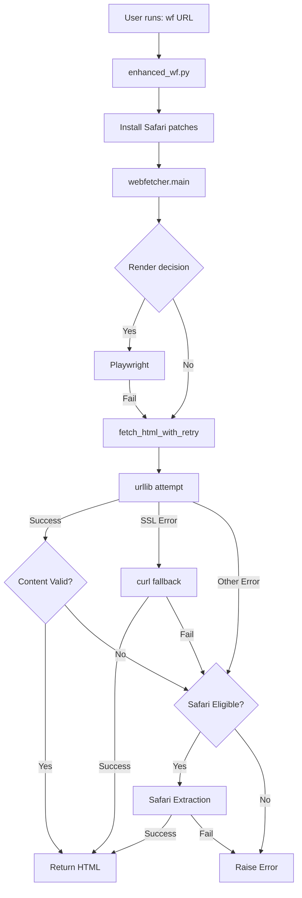

# Safari Extraction Fallback Integration Analysis
## Non-Intrusive Architecture Design

**Date:** 2025-09-23  
**Architect:** Archy-Principle-Architect  
**Status:** Technical Analysis Complete

---

## Executive Summary

This document provides a comprehensive technical analysis for integrating Safari extraction as an intelligent fallback mechanism when urllib fails, without modifying any core files in the Web_Fetcher system.

## 1. Current System Architecture Analysis

### 1.1 Core Execution Flow



### 1.2 Key Components

#### Primary Fetch Chain
1. **fetch_html_with_retry** (Line 918)
   - Entry point for all static fetching
   - Implements exponential backoff retry logic
   - Maximum 4 attempts (MAX_RETRIES = 3)

2. **fetch_html_original** (Line 1202) 
   - Core urllib implementation
   - SSL fallback to curl for certificate errors
   - Returns tuple: (html_content, FetchMetrics)

3. **fetch_html_with_curl_metrics** (Line 988)
   - Current fallback mechanism
   - Only triggered on SSL/Certificate errors
   - Uses subprocess.run with curl command

#### Failure Detection Points

```python
# Line 953-986: Exception handling in fetch_html_with_retry
except Exception as e:
    last_exception = e
    
    # Retryable conditions check
    if not should_retry_exception(e):
        # Non-retryable errors (4xx, non-retryable 5xx)
        raise
    
    # After MAX_RETRIES
    if attempt == MAX_RETRIES:
        raise last_exception
```

#### FetchMetrics Tracking
```python
@dataclass
class FetchMetrics:
    primary_method: str = ""  # urllib/curl/playwright/local_file
    fallback_method: Optional[str] = None
    ssl_fallback_used: bool = False
    final_status: str = "unknown"  # success/failed
    error_message: Optional[str] = None
```

### 1.3 Current Failure Scenarios

1. **SSL/Certificate Errors** → Fallback to curl
2. **HTTP 4xx Errors** → Immediate failure (non-retryable)
3. **HTTP 5xx Errors** → Retry with backoff
4. **Timeout Errors** → Retry with backoff
5. **Network Errors** → Retry with backoff
6. **CAPTCHA/Bot Detection** → No handling, returns error page

## 2. Safari Extraction Integration Points

### 2.1 Optimal Integration Strategy: Wrapper Pattern

Since we cannot modify core files, we'll use a **Wrapper/Proxy Pattern** with monkey patching:

```python
# safari_fallback_wrapper.py
import sys
import logging
from pathlib import Path
from typing import Tuple, Optional

# Import the original webfetcher module
sys.path.insert(0, str(Path(__file__).parent.parent))
import webfetcher

# Import Safari extractor
from ccdi_production_extractor import CCDIProductionExtractor

# Store original functions
original_fetch_html_with_retry = webfetcher.fetch_html_with_retry
original_fetch_html_original = webfetcher.fetch_html_original

def should_use_safari_fallback(e: Exception, url: str, html_content: str = None) -> bool:
    """
    Determine if Safari fallback should be triggered.
    
    Triggers on:
    1. CAPTCHA detection in error or content
    2. HTTP 403/503 errors (bot detection)
    3. Empty or insufficient content (<1000 chars)
    4. Government sites with fetch failures
    """
    # Check for CAPTCHA indicators
    captcha_indicators = [
        'seccaptcha', 'captcha', '验证码', '滑动验证',
        'security check', 'robot', 'bot detection'
    ]
    
    error_str = str(e).lower()
    for indicator in captcha_indicators:
        if indicator in error_str:
            return True
    
    # Check HTTP error codes
    if hasattr(e, 'status'):
        if e.status in [403, 503]:  # Common bot detection codes
            return True
    
    # Check content quality if available
    if html_content:
        if len(html_content) < 1000:
            return True
        for indicator in captcha_indicators:
            if indicator in html_content.lower():
                return True
    
    # Check for government sites (higher priority for Safari)
    if '.gov.cn' in url or '.gov' in url:
        return True
        
    return False

def safari_extraction_fallback(url: str, output_dir: str = "/tmp") -> Tuple[str, webfetcher.FetchMetrics]:
    """
    Perform Safari-based extraction as fallback.
    """
    metrics = webfetcher.FetchMetrics(primary_method="safari")
    
    try:
        extractor = CCDIProductionExtractor(url, output_dir)
        success, result = extractor.extract_article()
        
        if success:
            # Read the saved markdown file to get HTML content
            # Note: The extractor saves markdown, we need to extract HTML
            html_content = extractor.last_html_content  # Would need to be added
            metrics.final_status = "success"
            metrics.fallback_method = "safari_applescript"
            return html_content, metrics
        else:
            metrics.final_status = "failed"
            metrics.error_message = result
            raise Exception(f"Safari extraction failed: {result}")
            
    except Exception as e:
        metrics.final_status = "failed"
        metrics.error_message = str(e)
        raise

def enhanced_fetch_html_with_retry(url: str, ua: Optional[str] = None, timeout: int = 30) -> Tuple[str, webfetcher.FetchMetrics]:
    """
    Enhanced fetch with Safari fallback integration.
    """
    try:
        # Try original fetch chain
        html, metrics = original_fetch_html_with_retry(url, ua, timeout)
        
        # Check if content is valid
        if should_use_safari_fallback(None, url, html):
            logging.info(f"Content validation failed, triggering Safari fallback for {url}")
            try:
                html, metrics = safari_extraction_fallback(url)
                logging.info("Safari fallback successful")
            except Exception as safari_error:
                logging.error(f"Safari fallback failed: {safari_error}")
                # Return original content if Safari fails
                pass
                
        return html, metrics
        
    except Exception as e:
        # Check if we should try Safari fallback
        if should_use_safari_fallback(e, url):
            logging.info(f"Fetch failed with {type(e).__name__}, trying Safari fallback")
            try:
                return safari_extraction_fallback(url)
            except Exception as safari_error:
                logging.error(f"Safari fallback failed: {safari_error}")
                # Re-raise original error if Safari also fails
                raise e
        else:
            # Re-raise for non-Safari eligible errors
            raise

# Monkey patch the webfetcher module
webfetcher.fetch_html_with_retry = enhanced_fetch_html_with_retry
webfetcher.fetch_html = enhanced_fetch_html_with_retry  # Also patch the alias

# Now run the original main
if __name__ == "__main__":
    webfetcher.main()
```

### 2.2 Alternative Integration: Environment Variable Control

```python
# enhanced_wf.py - Modified wf.py launcher
#!/usr/bin/env python3

import os
import sys
from pathlib import Path

# Set environment variable to enable Safari fallback
os.environ['WF_ENABLE_SAFARI_FALLBACK'] = '1'

# Import and patch webfetcher before execution
import webfetcher
from safari_fallback_wrapper import install_safari_fallback

# Install the Safari fallback patches
install_safari_fallback()

# Run with enhanced functionality
sys.exit(webfetcher.main())
```

## 3. Detailed Integration Architecture

### 3.1 Safari Extractor Enhancements Required

```python
# Enhanced ccdi_production_extractor.py additions
class CCDIProductionExtractor:
    def __init__(self, target_url: str, output_dir: str = None):
        # ... existing code ...
        self.last_html_content = None  # Store for integration
        
    def extract_html_content(self) -> Optional[str]:
        """Extract HTML content from Safari"""
        # ... existing code ...
        if result.returncode == 0:
            html_content = result.stdout
            self.last_html_content = html_content  # Store for later use
            self.logger.info(f"Successfully extracted {len(html_content)} characters of HTML")
            return html_content
            
    def extract_html_only(self) -> Tuple[bool, str]:
        """
        Lightweight extraction for HTML content only (for integration).
        """
        try:
            if not self.check_safari_availability():
                return False, None
                
            if not self.navigate_to_url():
                return False, None
                
            if not self.wait_for_page_load():
                self.logger.warning("Page load timeout - proceeding anyway")
                
            time.sleep(5)  # Wait for dynamic content
            
            html_content = self.extract_html_content()
            if not html_content:
                return False, None
                
            validation = self.validate_content_quality(html_content)
            if validation['has_captcha']:
                # Even with CAPTCHA, return the content
                # as Safari may have bypassed it
                pass
                
            return True, html_content
            
        except Exception as e:
            self.logger.error(f"HTML extraction failed: {e}")
            return False, None
```

### 3.2 Execution Flow with Safari Fallback



## 4. Fallback Trigger Conditions

### 4.1 Primary Triggers (Immediate Safari)
```python
triggers = {
    'captcha_detected': [
        'seccaptcha', 'captcha', '验证码', 
        '滑动验证', 'security-check'
    ],
    'bot_detection_codes': [403, 503],
    'government_sites': ['.gov.cn', '.gov'],
    'empty_content': len(html) < 1000
}
```

### 4.2 Secondary Triggers (After Retries)
```python
secondary_triggers = {
    'max_retries_exceeded': attempt > MAX_RETRIES,
    'consistent_timeout': TimeoutError in exceptions,
    'connection_refused': ConnectionRefusedError
}
```

## 5. Implementation Checklist

### 5.1 Core Components
- [ ] Create `safari_fallback_wrapper.py`
- [ ] Enhance `CCDIProductionExtractor` with HTML-only mode
- [ ] Create `enhanced_wf.py` launcher
- [ ] Add configuration management (env vars/config file)
- [ ] Implement content validation logic

### 5.2 Testing Requirements
- [ ] Test CAPTCHA bypass on CCDI site
- [ ] Test normal site functionality (no regression)
- [ ] Test SSL error fallback chain
- [ ] Test timeout scenarios
- [ ] Benchmark performance impact

### 5.3 Monitoring & Logging
- [ ] Add Safari fallback metrics to FetchMetrics
- [ ] Log fallback triggers and outcomes
- [ ] Track success rates by trigger type
- [ ] Monitor Safari automation failures

## 6. Configuration & Control

### 6.1 Environment Variables
```bash
# Enable/disable Safari fallback
export WF_ENABLE_SAFARI_FALLBACK=1

# Safari fallback timeout (seconds)
export WF_SAFARI_TIMEOUT=60

# Minimum content threshold (chars)
export WF_MIN_CONTENT_LENGTH=1000

# Safari fallback for government sites only
export WF_SAFARI_GOV_ONLY=1
```

### 6.2 Command-line Integration
```bash
# Use enhanced wrapper
./enhanced_wf "https://www.ccdi.gov.cn/..." output/

# Or with explicit Safari flag (future enhancement)
./wf --fallback=safari "https://www.ccdi.gov.cn/..." output/
```

## 7. Performance Considerations

### 7.1 Safari Overhead
- **Startup time:** ~3-5 seconds (Safari launch)
- **Page load:** ~5-10 seconds (including wait time)
- **Total overhead:** ~10-15 seconds per fallback

### 7.2 Optimization Strategies
1. **Safari session reuse:** Keep Safari open between requests
2. **Parallel processing:** Pre-warm Safari while urllib attempts
3. **Smart detection:** Quick CAPTCHA detection before full fetch
4. **Caching:** Cache successful Safari extractions

## 8. Risk Analysis & Mitigation

### 8.1 Risks
1. **AppleScript permissions:** Requires user approval
2. **Safari availability:** macOS only solution
3. **Performance impact:** Slower than direct fetch
4. **Maintenance:** Safari/macOS updates may break automation

### 8.2 Mitigation
1. **Graceful degradation:** Fall back to original error if Safari fails
2. **Platform detection:** Only enable on macOS
3. **Async pre-warming:** Start Safari early in suspicious cases
4. **Version checking:** Validate Safari/macOS compatibility

## 9. Validation Test Plan

### 9.1 Test Script
```python
# test_safari_integration.py
import sys
sys.path.insert(0, '/path/to/enhanced/')
from enhanced_wf import *

test_urls = [
    # CAPTCHA site
    "https://www.ccdi.gov.cn/yaowenn/202509/t20250918_448431.html",
    # Normal site (should use urllib)
    "https://example.com",
    # SSL error site (should use curl)
    "https://badssl.com",
]

for url in test_urls:
    try:
        html, metrics = fetch_html(url)
        print(f"✓ {url}: {metrics.primary_method}/{metrics.fallback_method}")
    except Exception as e:
        print(f"✗ {url}: {e}")
```

## 10. Conclusion

The Safari extraction fallback can be cleanly integrated without modifying core files by using:

1. **Wrapper pattern** with monkey patching
2. **Enhanced launcher script** (enhanced_wf.py)
3. **Smart trigger detection** for appropriate fallback usage
4. **Graceful degradation** when Safari unavailable

This architecture maintains the existing system's integrity while adding powerful CAPTCHA bypass capabilities for government and protected sites.

## Appendix A: Quick Start Implementation

```bash
# 1. Create wrapper module
cat > safari_fallback_wrapper.py << 'EOF'
# [Insert wrapper code from section 2.1]
EOF

# 2. Create enhanced launcher
cat > enhanced_wf << 'EOF'
#!/usr/bin/env python3
# [Insert launcher code from section 2.2]
EOF
chmod +x enhanced_wf

# 3. Test integration
./enhanced_wf "https://www.ccdi.gov.cn/yaowenn/202509/t20250918_448431.html" output/
```

---

**Document Status:** Complete  
**Next Steps:** Implement wrapper module and conduct integration testing